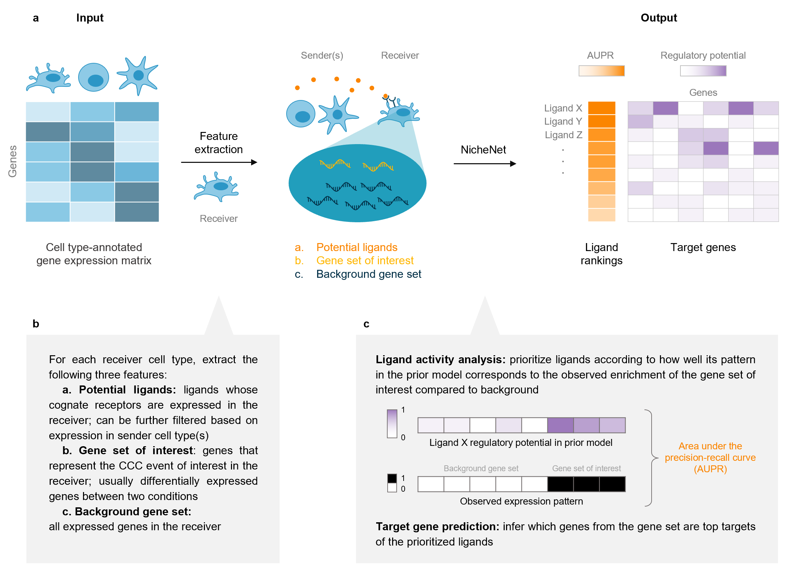
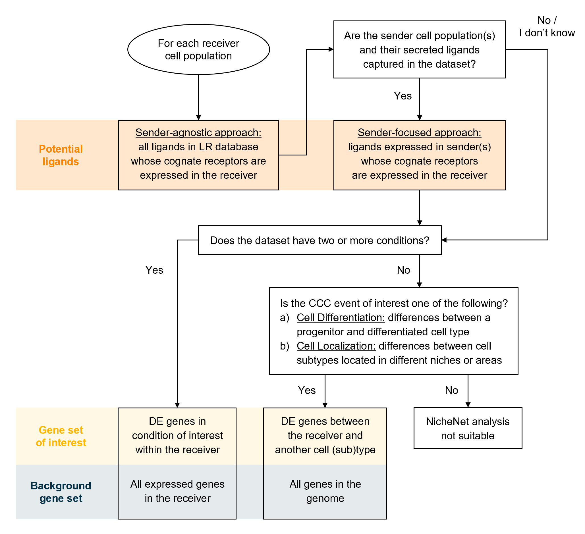

```{r setup, include=FALSE}
knitr::opts_chunk$set(echo = TRUE)
```

## Installation and data loading

### Installation

NicheNet can be installed by running the following command in R:

```{r software installation}
if (!requireNamespace("devtools", quietly=TRUE))
  install.packages("devtools") 

devtools::install_github("saeyslab/nichenetr")

```

### Input data

The main function of NicheNet only needs a list of gene names for the 1) gene set of interest, 2) expressed ligands, and 3) expressed receptors. We provide code to obtain these genes, but as minimal input users need a gene expression matrix with cell type annotations. We do recommend users to provide a Seurat (at least v3) object for additional helper functions, but this is not strictly necessary.

{width=70%}

### Example data

As example expression data of interacting cells, we will use mouse NICHE-seq data from Medaglia et al. (2017) to explore intercellular communication in the T cell area in the inguinal lymph node before and 72 hours after lymphocytic choriomeningitis virus (LCMV) infection. Specifically, we will prioritize which ligands can best explain the downstream changes after LCMV infection in CD8 T cells as the receiver population. This dataset contains 13,541 genes and 5,027 cells from 6 cell populations: CD4 T cells (including regulatory T cells), CD8 T cells, B cells, NK cells, dendritic cells (DCs) and inflammatory monocytes.

The data can be downloaded by clicking "seuratObj.rds" at [https://zenodo.org/record/3531889]. To download the file with the command line, commands like wget or curl can be used (Linux/macOS): 

`wget https://zenodo.org/record/3531889/files/seuratObj.rds`

To download the file within the R session, entering the following commands:

```{r download data within the R session}

options(timeout = 3600) # increase time limit for downloading the data 
seuratObj <- readRDS(url("https://zenodo.org/record/3531889/files/seuratObj.rds")) 

```

If the file is downloaded within the R session, it will have to be downloaded again once the session is restarted.

### Human/Mouse networks

Three networks are required to run the NicheNet analysis: the ligand-target prior model, the ligand-receptor network, and the weighted ligand-receptor network. We provide these networks with either human or mouse gene symbols and they can be downloaded at [https://zenodo.org/record/7074291/]. This repository also contains other networks not used in the main analysis but in an additional visualization step (Step 30) and during model construction (Box 1). As with the example data, they can be downloaded locally through the website or command line, or in the R session. We recommend users to download them locally for convenience. 

#### Downloading data in a terminal

```{r download NicheNet networks CLI, eval=FALSE}

ZENODO_PATH=https://zenodo.org/record/7074291/files

# Human ligand-target, ligand-receptor, and weighted networks
wget $ZENODO_PATH/ligand_target_matrix_nsga2r_final.rds
wget $ZENODO_PATH/lr_network_human_21122021.rds
wget $ZENODO_PATH/weighted_networks_nsga2r_final.rds

# Mouse ligand-target, ligand-receptor, and weighted networks
wget $ZENODO_PATH/ligand_target_matrix_nsga2r_final_mouse.rds
wget $ZENODO_PATH/lr_network_mouse_21122021.rds
wget $ZENODO_PATH/weighted_networks_nsga2r_final_mouse.rds

```

#### Download the file in the R session, mouse example

```{r download NicheNet networks}

zenodo_path <- "https://zenodo.org/record/7074291/files/" 

ligand_target_matrix <- readRDS(url(paste0(zenodo_path, "ligand_target_matrix_nsga2r_final_mouse.rds"))) 
lr_network <- readRDS(url(paste0(zenodo_path, "lr_network_mouse_21122021.rds"))) 
weighted_networks <- readRDS(url(paste0(zenodo_path, "weighted_networks_nsga2r_final_mouse.rds"))) 


ligand_target_matrix[1:5, 1:5] # target genes in rows, ligands in columns
head(lr_network)
head(weighted_networks$lr_sig) # interactions and their weights in the ligand-receptor + signaling network
```

The ligand-target prior model is a matrix describing the potential that a ligand may regulate a target gene, and it is used to run the ligand activity analysis. The ligand-receptor network contains information on potential ligand-receptor bindings, and it is used to identify potential ligands. Finally, the weighted ligand-receptor network contains weights representing the potential that a ligand will bind to a receptor, and it is used for visualization.

These networks were translated from human to mouse gene names using one-to-one orthologs when feasible, and one-to-many conversion was allowed when necessary (for instance, when one human gene symbol corresponded to two mouse gene symbols). Users that are interested in building prior models for other organisms can either create an organism-specific model using data sources relevant to that organism, or use the existing human NicheNet model to convert human gene symbols to their corresponding one-to-one orthologs in the organism of interest. However, this decision depends on one hand, the availability of data for the organism of interest and on the other, the homology between humans and the organism of interest. For instance, using the human model and converting gene symbols might work for primates, but creating a new model from species-specific data sources is better suited for organisms like Drosophila.

## Procedure

Here, we describe the procedure for both the sender-focused and sender-agnostic approach, as shown here:


{width=75%}

As two conditions are present in this example dataset, the gene set of interest is chosen as the DE genes between these conditions in the receiver cell type. Box 2 details the use of wrapper functions that can automatically run Steps 5-23.

### Feature extraction

1. Load required libraries.

```{r feature extraction - I, warning=FALSE, message=FALSE}

library(nichenetr)
library(Seurat) 
library(tidyverse) 

```

2. *(Optional)* For older Seurat objects, update it to be compatible with the currently installed Seurat version.

```{r feature extraction - II, message=FALSE, warning=FALSE}
seuratObj <- UpdateSeuratObject(seuratObj)

seuratObj
```

3. Set the cell type annotation column as the identity of the Seurat object.

```{r feature extraction - III}

Idents(seuratObj) <- seuratObj$celltype 

```

4. Define a "receiver" cell population. The receiver cell population can only consist of one cell type.

```{r feature extraction - IV}

receiver <- "CD8 T" 

```

5. Determine which genes are expressed in the receiver cell population. The function `get_expressed_genes` considers genes to be expressed if they have non-zero counts in a certain percentage of the cell population (by default set at 10%). Here, we have lowered the threshold to 5% (`pct`) as some of the ligands and receptors are very lowly expressed. Users are also free to define expressed genes differently in a way that fits their data.  

```{r feature extraction - V}

expressed_genes_receiver <- get_expressed_genes(receiver, seuratObj,  pct = 0.05)

# Preview
length(expressed_genes_receiver)
head(expressed_genes_receiver)
```


6. Get a list of all receptors available in the ligand-receptor network, and define expressed receptors as genes that are in the ligand-receptor network and expressed in the receiver.

```{r feature extraction - VI}

all_receptors <- unique(lr_network$to)  
expressed_receptors <- intersect(all_receptors, expressed_genes_receiver) 

# Preview
length(expressed_receptors)
head(expressed_receptors)

```

7. Define the potential ligands as all ligands whose cognate receptors are expressed.

```{r feature extraction - VII}

potential_ligands <- lr_network[lr_network$to %in% expressed_receptors, ] 
potential_ligands <- unique(potential_ligands$from) 

# Preview
length(potential_ligands)
head(potential_ligands)

```

8. *(Optional)* For the sender-focused approach, define sender cell types and expressed genes in all populations combined. Then, filter potential ligands to those that are expressed in sender cells.

```{r feature extraction - VIII}

sender_celltypes <- c("CD4 T", "Treg", "Mono", "NK", "B", "DC") 
list_expressed_genes_sender <- lapply(sender_celltypes, function(celltype) {
    get_expressed_genes(celltype, seuratObj, pct = 0.05)
  }) 
expressed_genes_sender <- unique(unlist(list_expressed_genes_sender)) 
potential_ligands_focused <- intersect(potential_ligands, expressed_genes_sender) 

# Preview
length(expressed_genes_sender)
head(expressed_genes_sender)
length(potential_ligands_focused)
head(potential_ligands_focused)
```

9. Define the reference condition and condition of interest. The condition of interest is the condition after the CCC event has taken place, or the 'case' group in case-control studies. Here, it represents the condition after LCMV infection.


```{r feature extraction - IX}

condition_oi <- "LCMV" 
condition_reference <- "SS" 

```

10. Define the gene set of interest that represents the cell-cell communication event to be studied. First, create a new Seurat object that only contains the receiver cell type. Then, perform DE analysis between the treatment conditions within the receiver cell type. Finally, define the gene set of interest as significantly DE genes, i.e., genes with adjusted p-value lower than or equal to 0.05 and absolute log-fold change greater than 0.25.

By default, both genes that are up and downregulated are considered. Users can choose to focus on only one direction (typically upregulation) by removing the `abs()` function and adjusting the equality term to either \>= 0.25 or \<= -0.25 for up and downregulation, respectively. We recommend the gene set of interest to contain between 20 and 2000 genes for optimal ligand activity prediction. Moreover, the number of background genes should be sufficiently greater than those of the gene set of interest.

```{r feature extraction - X}

seurat_obj_receiver <- subset(seuratObj, idents = receiver)
DE_table_receiver <- FindMarkers(object = seurat_obj_receiver,  
                                 ident.1 = condition_oi, ident.2 = condition_reference,
                                 group.by = "aggregate",
                                 min.pct = 0.05) 

geneset_oi <- DE_table_receiver[DE_table_receiver$p_val_adj <= 0.05 & abs(DE_table_receiver$avg_log2FC) >= 0.25, ] 
geneset_oi <- rownames(geneset_oi)[rownames(geneset_oi) %in% rownames(ligand_target_matrix)] 

# Preview
length(geneset_oi)
head(geneset_oi)
```

11. Determine background genes as all the genes expressed in the receiver cell type that are also in the ligand-target matrix.

```{r feature extraction - XI}

background_expressed_genes <- expressed_genes_receiver[ 
expressed_genes_receiver %in% rownames(ligand_target_matrix)] 

# Preview
length(background_expressed_genes)
head(background_expressed_genes)
```

### Ligand activity analysis and downstream prediction

12. Perform the ligand activity analysis, then sort the ligands based on the area under the precision-recall curve (AUPR).

```{r ligand activity - I}

ligand_activities <- predict_ligand_activities(
  geneset = geneset_oi,
  background_expressed_genes = background_expressed_genes,
  ligand_target_matrix = ligand_target_matrix,
  potential_ligands = potential_ligands) 

ligand_activities <- ligand_activities[order(ligand_activities$aupr_corrected, 	decreasing = TRUE), ] 

# Preview
dim(ligand_activities)
head(ligand_activities)
```

13. *(Optional)* If performing the sender-focused approach, subset the ligand activities to only contain expressed ligands.
**Note:** When using the sender-agnostic approach, simply replace `ligand_activities` with `ligand_activities_all` in Steps 14 and 20.

```{r ligand activity - II}

ligand_activities_all <- ligand_activities 
ligand_activities <- ligand_activities[ligand_activities$test_ligand %in% potential_ligands_focused, ] 

# Preview
dim(ligand_activities)
head(ligand_activities)
```

14. Obtain the names of the top 30 ligands. Box 3 describes a method for assessing the quality of predicted ligands. 

```{r ligand activity - III}

best_upstream_ligands <- top_n(ligand_activities, 30, aupr_corrected)$test_ligand 
 
# Preview
length(best_upstream_ligands)
head(best_upstream_ligands)
```

15. Infer which genes in the gene set of interest have the highest regulatory potential for each top-ranked ligand. The function get_weighted_ligand_target_links will return genes that are in the gene set of interest and are the top `n` targets of a ligand (default: `n = 200`).

```{r ligand activity - IV}

active_ligand_target_links_df <- lapply(best_upstream_ligands,
                                        get_weighted_ligand_target_links, 
                                        geneset = geneset_oi, 
                                        ligand_target_matrix = ligand_target_matrix, 
                                        n = 200) 

active_ligand_target_links_df <- drop_na(bind_rows(active_ligand_target_links_df)) 

# Preview
dim(active_ligand_target_links_df)
head(active_ligand_target_links_df)
```

16. Similarly, identify which receptors have the highest interaction potential with the top-ranked ligands.

```{r ligand activity - V}

ligand_receptor_links_df <- get_weighted_ligand_receptor_links(
  best_upstream_ligands, expressed_receptors,
  lr_network, weighted_networks$lr_sig) 

# Preview
dim(ligand_receptor_links_df)
head(ligand_receptor_links_df)

```

### Visualizations

Visualizations covered in this section include: heatmaps of ligand-target regulatory potential (Steps 17-18), ligand-receptor interaction potential (Step 19), ligand activity (Step 20), and log-fold change of ligands between treatment conditions (Steps 21-22); a dot plot of cell type expression and percentage (Step 23); a line plot comparing ligand rankings between the sender-agnostic and -focused approach (Step 24); chord diagrams (Steps 25-29); and a signaling graph (Steps 30-31). This section can be followed in its entirety only for the sender-focused approach (i.e., if all optional code in the previous sections have been executed); for the sender-agnostic approach, only Steps 17-20 and Steps 30-31 are relevant.

17. Prepare the weighted ligand-target data frame for visualization by transforming it into matrix. By default, regulatory potentials lower than the 25th percentile are set to zero for visualization clarity. This cutoff parameter can freely be tuned by the user.

```{r visualizations-I}

active_ligand_target_links <- prepare_ligand_target_visualization(
  ligand_target_df = active_ligand_target_links_df,
  ligand_target_matrix = ligand_target_matrix,
  cutoff = 0.25) 

```

18. Order the rows to follow the rankings of the ligands, and the columns alphabetically (Figure 3a).

```{r visualizations-II}

order_ligands <- rev(intersect(best_upstream_ligands, colnames(active_ligand_target_links))) 
order_targets <- intersect(unique(active_ligand_target_links_df$target), rownames(active_ligand_target_links)) 

vis_ligand_target <- t(active_ligand_target_links[order_targets,order_ligands])

(make_heatmap_ggplot(vis_ligand_target, y_name = "Prioritized ligands", x_name = "Predicted target genes",
                     color = "purple", legend_title = "Regulatory potential") + 
    scale_fill_gradient2(low = "whitesmoke",  high = "purple")) 

```

19. Create a heatmap for ligand-receptor interactions (Figure 3b).

```{r visualizations-III}

vis_ligand_receptor_network <- prepare_ligand_receptor_visualization(
  ligand_receptor_links_df, best_upstream_ligands,
  order_hclust = "receptors") 

(make_heatmap_ggplot(t(vis_ligand_receptor_network), 
                     y_name = "Ligands", x_name = "Receptors",  
                     color = "mediumvioletred", legend_title = "Prior interaction potential")) 
 
```

20. Create a heatmap of the ligand activity measure (Figure 3c).

```{r visualizations-IV}

ligand_aupr_matrix <- column_to_rownames(ligand_activities, "test_ligand") 
ligand_aupr_matrix <- ligand_aupr_matrix[rev(best_upstream_ligands), "aupr_corrected", drop=FALSE] 
vis_ligand_aupr <- as.matrix(ligand_aupr_matrix, ncol = 1) 

(make_heatmap_ggplot(vis_ligand_aupr,
                     "Prioritized ligands", "Ligand activity", 
                     legend_title = "AUPR", color = "darkorange") + 
    theme(axis.text.x.top = element_blank()))  

```

21. For each cell type, compute the log-fold change of the top-ranked ligands between treatment conditions.

```{r visualizations-V}

celltype_order <- levels(Idents(seuratObj)) 

DE_table_top_ligands <- lapply(
  celltype_order[celltype_order %in% sender_celltypes],
  get_lfc_celltype, 
  seurat_obj = seuratObj,
  condition_colname = "aggregate",
  condition_oi = condition_oi,
  condition_reference = condition_reference,
  celltype_col = "celltype",
  min.pct = 0, logfc.threshold = 0,
  features = best_upstream_ligands 
) 

DE_table_top_ligands <- reduce(DE_table_top_ligands, full_join) 
DE_table_top_ligands <- column_to_rownames(DE_table_top_ligands, "gene") 
 
```

22. Create the heatmap (Figure 3d).

```{r visualizations-VI}

vis_ligand_lfc <- as.matrix(DE_table_top_ligands[rev(best_upstream_ligands), ]) 

(make_threecolor_heatmap_ggplot(vis_ligand_lfc,
                                "Prioritized ligands", "LFC in Sender",
                                low_color = "midnightblue", mid_color = "white",
                                mid = median(vis_ligand_lfc), high_color = "red",
                                legend_title = "LFC")) 
 
```

23. Create a dot plot showing the average expression of ligands per cell type, as well as the percentage of cells from the cell type expressing the ligands (Figure 3e).

```{r visualizations-VII}

DotPlot(subset(seuratObj, celltype %in% sender_celltypes),
        features = rev(best_upstream_ligands), cols = "RdYlBu") + 
  coord_flip() +
  scale_y_discrete(position = "right") 

```

24. *(Optional)* Create a line plot comparing the rankings between the sender-agnostic and sender-focused approach (Figure 3f).

```{r visualizations-VIII}

(make_line_plot(ligand_activities = ligand_activities_all,
                potential_ligands = potential_ligands_focused) +
   theme(plot.title = element_text(size=11, hjust=0.1, margin=margin(0, 0, -5, 0))))

```

25. To create a ligand-target chord diagram, assign each ligand to a specific cell type. A ligand is only assigned to a cell type if that cell type is the only one to show an average expression of that ligand that is higher than the mean + one standard deviation across all cell types. Otherwise, it is assigned to "General".

```{r visualizations-IX}

ligand_type_indication_df <- assign_ligands_to_celltype(seuratObj, best_upstream_ligands[1:20], celltype_col = "celltype") 

# Preview
dim(ligand_type_indication_df)
head(ligand_type_indication_df)

```


26. Using the weighted ligand-target data frame from Step 15, group target genes and filter out the lowest 40% of the regulatory potentials. In this case, there is only one grouping of target genes (DE genes after LCMV infection), but users can define multiple target gene groups if applicable. In case the resulting chord diagram is still overcrowded, users may adjust the `cutoff` parameter to filter out even more ligand-target links.

```{r visualizations-X}

active_ligand_target_links_df$target_type <- "LCMV-DE" 
circos_links <- get_ligand_target_links_oi(ligand_type_indication_df,
                                           active_ligand_target_links_df, cutoff = 0.40) 

# Preview
dim(circos_links)
head(circos_links)

```

27. Assign colors to cell types and target gene groups. Then, prepare the data frame for visualization: the function assigns colors to ligands and targets and calculates gaps between sectors of the chord diagram.

```{r visualizations-XI}

ligand_colors <- c("General" = "#377EB8", "NK" = "#4DAF4A", "B" = "#984EA3",
                   "Mono" = "#FF7F00", "DC" = "#FFFF33", "Treg" = "#F781BF",
                   "CD8 T"= "#E41A1C") 
target_colors <- c("LCMV-DE" = "#999999") 

vis_circos_obj <- prepare_circos_visualization(circos_links,
                                               ligand_colors = ligand_colors,
                                               target_colors = target_colors) 

```

28. Draw the chord diagram (Figure 3g).

```{r visualizations-XII, fig.width=10}

make_circos_plot(vis_circos_obj, transparency = FALSE,  args.circos.text = list(cex = 0.5)) 

```

29. To create a ligand-receptor chord diagram, perform Steps 26-28 using the weighted ligand-receptor data frame from Step 16. As `prepare_circos_visualization` accesses "target" and "target_type" columns, it is necessary to rename the columns accordingly even though the data frame contains receptor and not target gene information. When drawing the plot, the argument `link.visible` = TRUE is also necessary for making all links visible, since no cutoff is used to filter out ligand-receptor interactions.

```{r visualizations-XIII}

lr_network_top_df <- rename(ligand_receptor_links_df, ligand=from, target=to) 
lr_network_top_df$target_type = "LCMV_CD8T_receptor" 
lr_network_top_df <- inner_join(lr_network_top_df, ligand_type_indication_df) 

receptor_colors <- c("LCMV_CD8T_receptor" = "#E41A1C") 

vis_circos_receptor_obj <- prepare_circos_visualization(lr_network_top_df,
                                                        ligand_colors = ligand_colors,
                                                        target_colors = receptor_colors) 
make_circos_plot(vis_circos_receptor_obj, transparency = TRUE,
                 link.visible = TRUE,  args.circos.text = list(cex = 0.8)) 

```

30. To create a signaling graph, first download the ligand-transcription factor matrix. Then, extract the most highly weighted paths from the ligand to the target genes of interest. The number of regulators that are extracted can be adjusted using `top_n_regulators`. By setting `minmax_scaling = TRUE`, we perform min-max scaling to make the weights between the signaling and gene regulatory network more comparable. Additionally, it is possible to check which data sources support the inferred pathway by using the function `infer_supporting_datasources`. This would require separate signaling and gene regulatory networks as input (see Box 1 for code to download these networks).

```{r visualizations-XIV}

ligand_tf_matrix <- readRDS(url("https://zenodo.org/record/7074291/files/ligand_tf_matrix_nsga2r_final_mouse.rds")) 
ligands_oi <- "Ebi3" 
targets_oi <- c("Irf1", "Irf9") 

active_signaling_network <- get_ligand_signaling_path(ligands_all = ligands_oi,
                                                      targets_all = targets_oi,
                                                      weighted_networks = weighted_networks,
                                                      ligand_tf_matrix = ligand_tf_matrix,
                                                      top_n_regulators = 4, minmax_scaling = TRUE) 

```

31. Convert the data frames into a DiagrammeR object, and render the signaling graph (Figure 3h).

```{r visualizations-XV}

signaling_graph <- diagrammer_format_signaling_graph(
  signaling_graph_list = active_signaling_network,
  ligands_all = ligands_oi, targets_all = targets_oi,
  sig_color = "indianred", gr_color = "steelblue") 

DiagrammeR::render_graph(signaling_graph, layout = "tree") 

```

### Prioritization of ligand-receptor pairs

This section is only applicable for the sender-focused approach. Whereas Steps 12-14 only prioritize ligands based on ligand activity, this section incorporates relative expression and differential expression to further prioritize ligand-receptor pairs associated with specific sender and receiver cell types.

32. Filter the ligand-receptor network to only contain expressed interactions. 

```{r prioritization - I}

lr_network_filtered <- filter(lr_network, from %in% potential_ligands_focused &
                                to %in% expressed_receptors)[, c("from", "to")]

```

33. Calculate the values required for prioritization, including DE between cell types, average expression, and DE between conditions. To use the wrapper function, follow option A. To calculate these values step-by-step, follow option B.


A. **Using the wrapper function.**

(i) Run the wrapper function. 

```{r prioritization - II}
info_tables <- generate_info_tables( 
    seuratObj, 
    celltype_colname = "celltype", 
    senders_oi = sender_celltypes, 
    receivers_oi = receiver, 
    lr_network = lr_network_filtered, 
    condition_colname = "aggregate", 
    condition_oi = condition_oi, 
    condition_reference = condition_reference, 
    scenario = "case_control"
) 
```

(ii) Assign the output of the wrapper function to variables. 

```{r prioritization - III}

processed_DE_table <- info_tables$sender_receiver_de  
processed_expr_table <- info_tables$sender_receiver_info  
processed_condition_markers <- info_tables$lr_condition_de

# Preview
dim(processed_DE_table)
head(processed_DE_table)
dim(processed_expr_table)
head(processed_expr_table)
dim(processed_condition_markers)
head(processed_condition_markers)

```
 

(B) **Running step-by-step calculations.**

(i) Calculate DE between cell types within the condition of interest.

```{r prioritization - IV}

DE_table <- FindAllMarkers(subset(seuratObj, subset = aggregate == "LCMV"),
                           min.pct = 0, logfc.threshold = 0, return.thresh = 1,
                           features = unique(unlist(lr_network_filtered))) 

```

(ii) Calculate average expression of each gene per cell type.

```{r prioritization - V}

expression_info <- get_exprs_avg(seuratObj, "celltype",
                                 condition_colname = "aggregate",
                                 condition_oi = condition_oi,
                                 features = unique(unlist(lr_network_filtered)))

```

(iii) Calculate DE between conditions.

```{r prioritization - VI}

condition_markers <- FindMarkers(object = seuratObj,
                                 ident.1 = condition_oi, ident.2 = condition_reference,
                                 group.by = "aggregate",
                                 min.pct = 0, logfc.threshold = 0,
                                 features = unique(unlist(lr_network_filtered)))

condition_markers <- rownames_to_column(condition_markers, "gene") 

```

(iv) Process the data frames from Steps (i)-(iii) to follow the same format.

```{r prioritization - VII}

processed_DE_table <- process_table_to_ic(
  DE_table,
  table_type = "celltype_DE",
  lr_network_filtered,
  senders_oi = sender_celltypes,
  receivers_oi = receiver) 

processed_expr_table <- process_table_to_ic(
  expression_info,
  table_type = "expression",
  lr_network_filtered) 

processed_condition_markers <- process_table_to_ic( 
  condition_markers,
  table_type = "group_DE",
  lr_network_filtered) 

```


34. Generate the prioritization table containing rankings of cell-type-specific, ligand-receptor interactions. The "case_control" scenario sets all weights to one, while the "one_condition" scenario sets condition specificity to zero and the remaining weights to one.

```{r prioritization - VIII}

prioritized_table <- generate_prioritization_tables(
  processed_expr_table,
  processed_DE_table,
  ligand_activities,
  processed_condition_markers,
  scenario = "case_control") 

# Preview
dim(prioritized_table)
head(prioritized_table)

```

Users may provide custom weights in a named vector to the argument `prioritizing_weights`. The vector must contain the following names, which correspond to the following criteria:

- `de_ligand`: upregulation of the ligand in a sender cell type compared to other cell types
- `de_receptor`: upregulation of the receptor in a receiver cell type
- `exprs_ligand`: average expression of the ligand in the sender cell type
- `exprs_receptor`: average expression of the receptor in the receiver cell type
- `ligand_condition_specificity`: condition-specificity of the ligand across all cell types
- `receptor_condition_specificity`: condition-specificity of the receptor across all cell types

```{r prioritization - IX}

prioritizing_weights <- c("de_ligand" = 1,
                         "de_receptor" = 1,
                         "activity_scaled" = 1,
                         "exprs_ligand" = 1,
                         "exprs_receptor" = 1,
                         "ligand_condition_specificity" = 1,
                         "receptor_condition_specificity" = 1) 

```

35. Create a mushroom plot depicting ligand expression on one semicircle, and receptor expression on the other (Figure 3i).

```{r prioritization-X, fig.height=7, fig.width=8}

legend_adjust <- c(0.8, 0.7)
make_mushroom_plot(prioritized_table, top_n = 30,
                   show_all_datapoints = TRUE,
                   true_color_range = TRUE,
                   show_rankings = TRUE,
                   legend.title = element_text(size=8),
                   legend.text = element_text(size=8),
                   legend.key.size = unit(4, 'mm')) +
  theme(legend.justification = legend_adjust,
        axis.title.x = element_text(hjust = 0.25))

```

## Box 1. Constructing your own prior model

As the NicheNet prior model was constructed by integrating ligand-receptor, signaling, and gene regulatory databases, it is possible to replace each of these networks with external data sources. Constructing a customized prior model thus requires three directed networks, represented as data frames comprising three columns: `from`, `to`, and `source`. The `source` column contains the originating database of the interaction. As the reliability of each database can vary, we optimized the weights of each data source based on our validation procedure (as explained in Comparison with other methods). These optimized weights (`optimized_source_weights_df`), along with hyperparameters for model construction (`hyperparameter_list`), are provided in the NicheNet package. Key hyperparameters include correction factors for dominant hubs in the ligand-signaling and gene regulatory networks, as well as the central damping factor of the Personalized PageRank algorithm, the network propagation mechanism used to determine the ligand-target regulatory potential.

Note that the variable names of the networks have been changed from the manuscript in order to not overwrite the mouse networks, which will be used in Box 2.

```{r Construct your own prior model - I}

zenodo_path <- "https://zenodo.org/record/7074291/files/"
lr_network_human <- readRDS(url(paste0(zenodo_path, "lr_network_human_21122021.rds")))
sig_network_human <- readRDS(url(paste0(zenodo_path, "signaling_network_human_21122021.rds")))
gr_network_human <- readRDS(url(paste0(zenodo_path, "gr_network_human_21122021.rds")))

# Aggregate the individual data sources in a weighted manner to obtain
# a weighted integrated signaling network
weighted_networks_box1 <- construct_weighted_networks(
  lr_network = lr_network_human,
  sig_network = sig_network_human,
  gr_network = gr_network_human,
  source_weights_df = rename(optimized_source_weights_df, weight = avg_weight))

# Downweigh the importance of signaling and gene regulatory hubs 
# Use the optimized parameters of this 
weighted_networks_box1 <- apply_hub_corrections(
  weighted_networks = weighted_networks_box1,
  lr_sig_hub = hyperparameter_list[hyperparameter_list$parameter == "lr_sig_hub",]$avg_weight,
  gr_hub = hyperparameter_list[hyperparameter_list$parameter == "gr_hub",]$avg_weight
  ) 

```

In this example, we will calculate target gene regulatory potential scores for TNF and the combination TNF+IL6. 

```{r Construct your own prior model - II}
# To compute it for all 1248 ligands (~1 min):
# ligands <- as.list(unique(lr_network$from))

ligands <- list("TNF", c("TNF","IL6"))
ligand_target_matrix_box1 <- construct_ligand_target_matrix(
  weighted_networks = weighted_networks_box1,
  ligands = ligands,
  algorithm = "PPR",
  damping_factor = hyperparameter_list[hyperparameter_list$parameter == "damping_factor",]$avg_weight,
  ltf_cutoff = hyperparameter_list[hyperparameter_list$parameter == "ltf_cutoff",]$avg_weight
  )

```


A frequent use case is one where users are interested in replacing the ligand-receptor network in NicheNet with those of expression permutation tools in order to make their results more comparable. To achieve this, we recommend employing LIANA (Dimitrov et al., 2022), a comprehensive CCC framework that integrates both resources and computational algorithms for ligand-receptor interaction inference. The `show_resources` function is used to check which resources are present in LIANA, and `select_resource` returns a data frame of the interactions in that resource. The `decomplexify` function of LIANA is necessary for this integration, as it separate receptors into their respective subunits. Note that unlike before, `source_weights_df` only represents unoptimized weights, where the weight of every data source is 1.

```{r Construct your own prior model - III}
if (!requireNamespace("liana", quietly=TRUE))
  devtools::install_github("saezlab/liana")

liana_db <- liana::decomplexify(liana::select_resource("CellPhoneDB")[[1]])
liana_db <- rename(liana_db, from = source_genesymbol, to = target_genesymbol)
liana_db$source <- "liana"
liana_db <- select(liana_db, from, to, source)

# Change source weights data frame (but in this case all source weights are 1)
source_weights <- add_row(source_weights_df,
                          source = "liana",
                          weight = 1, .before = 1)

# Construct weighted network as before
weighted_networks_liana <- construct_weighted_networks(
  lr_network = liana_db,
  sig_network = sig_network_human,
  gr_network = gr_network_human,
  source_weights_df = source_weights)

```

## Box 2. Wrapper functions

To streamline the NicheNet analysis, we introduce three wrapper functions that automate Steps 5-23. The function `nichenet_seuratobj_aggregate` calculates the gene set of interest as the DE genes between two conditions within the receiver cell type. This function can be used to replicate the analysis in this paper as follows:

```{r Wrapper - I}

nichenet_output <- nichenet_seuratobj_aggregate(
  seurat_obj = seuratObj,
  receiver = "CD8 T",
  sender = c("CD4 T","Treg", "Mono", "NK", "B", "DC"),
  condition_colname = "aggregate",
  condition_oi = "LCMV",
  condition_reference = "SS",
  ligand_target_matrix = ligand_target_matrix,
  lr_network = lr_network,
  weighted_networks = weighted_networks) 

# Preview
names(nichenet_output)
```

Additionally, the sender-agnostic approach can be explicitly run by setting `sender = "undefined"`.

The resulting object is a list comprising various components, including the gene set of interest and background genes that were used for the analysis (`geneset_oi` and `background_expressed_genes`), output from the ligand activity analysis (`ligand_activities`), targets and receptors corresponding to the identified ligands (`top_targets` and `top_receptors`), and visualizations (`ligand_target_heatmap`, `ligand_expression_dotplot`, `ligand_receptor_heatmap`, etc.). If the sender-focused approach is used, the line plot from Step 24 will also be generated.

Another wrapper function, `nichenet_seuratobj_cluster_de`, calculates DE genes between two cell types as the gene set of interest. Additionally, when filtering for potential ligands, we only consider expressed ligands whose receptors are expressed by the "reference" receiver cell type. This function should only be used for specific biological scenarios, as shown in Figure 2. An example of using this function for the scenario where cell types differentiation occurs due to its niche is as follows:

```{r Wrapper - II, eval=FALSE}

nichenet_seuratobj_cluster_de(
  seurat_obj = seurat_obj,
  receiver_affected = differentiated_celltype,
  receiver_reference = progenitor_cell,
  sender = niche_celltypes,
  ligand_target_matrix, lr_network,
  weighted_networks)

```

The final wrapper function, `nichenet_seuratobj_aggregate_cluster_de`, combines the aforementioned wrappers. The gene set of interest is calculated as the DE genes between the affected receiver cell type under the condition of interest and the reference receiver cell type in the reference condition.

## Box 3. Assessing the quality of predicted ligands

We can assess the quality of prioritized ligands by constructing a random forest model built using the top 30 predicted ligands. The aim is to evaluate its ability to predict if a particular gene belongs to the target gene set. Using kfold cross-validation, 1/k of the target gene set is isolated as “unseen” data. The performance of the model can then be evaluated using classification metrics like AUPR and AUROC, or using Fisher’s exact test on the confusion matrix.  

```{r QC ligands - Random Forest, warning=FALSE}
# Define cross-validation folds and number of iterations
k <- 3
n <- 10

# Build random forest model and obtain prediction values
predictions_list <- lapply(1:n,
                           assess_rf_class_probabilities,
                           folds = k,
                           geneset = geneset_oi,
                           background_expressed_genes = background_expressed_genes,
                           ligands_oi = best_upstream_ligands,
                           ligand_target_matrix = ligand_target_matrix)

# Get classification metrics of the models, then calculate mean across all rounds
performances_cv <- bind_rows(lapply(predictions_list, classification_evaluation_continuous_pred_wrapper))
colMeans(performances_cv)

# Calculate fraction of target genes and non-target genes
# that are among the top 5% predicted targets
fraction_cv <- bind_rows(lapply(predictions_list,
                                calculate_fraction_top_predicted,
                                quantile_cutoff = 0.95),
                         .id = "round")

# In this case, ~30% of target genes are in the top targets
# compared to ~1% of the non-target genes
mean(filter(fraction_cv, true_target)$fraction_positive_predicted)
mean(filter(fraction_cv, !true_target)$fraction_positive_predicted)

# Perform Fischer's exact test
lapply(predictions_list,
       calculate_fraction_top_predicted_fisher,
       quantile_cutoff = 0.95)

# Get which genes had the highest prediction values
top_predicted_genes <- lapply(1:n, get_top_predicted_genes, predictions_list)
top_predicted_genes <- reduce(top_predicted_genes, full_join, by = c("gene","true_target"))
top_predicted_genes
```

**Session info**

```{r session Info}
sessionInfo()
```
