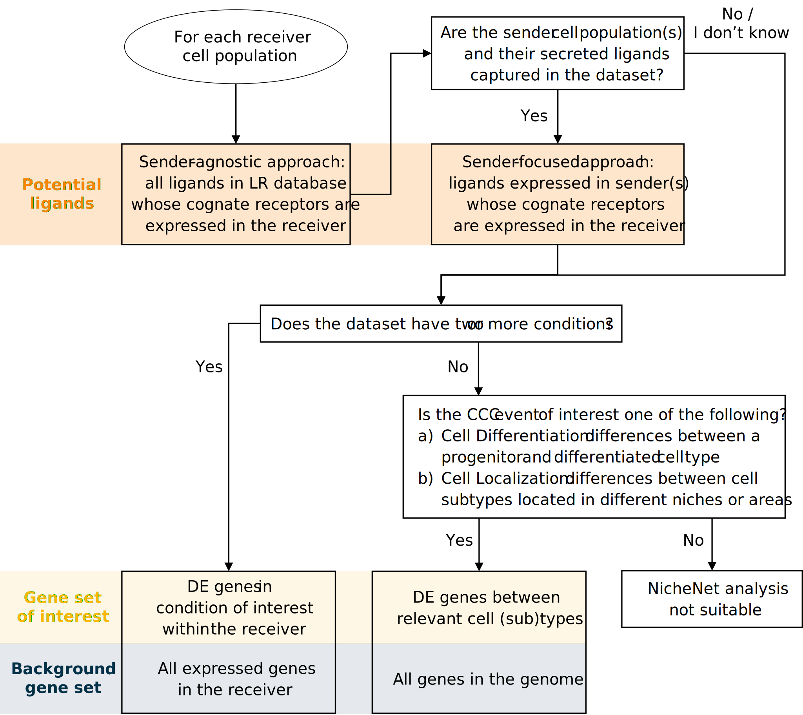

```{r setup, include=FALSE}
knitr::opts_chunk$set(echo = TRUE)
```

In this tutorial, we will demonstrate the procedure for the scenario where you want to explore cell-cell communication differences between cell types, instead of  between two conditions of the same cell type. This corresponds to the "Cell Localization" scenario in the flowchart below:

{width=75%}

### Loading data

We will be using the mouse liver scRNA-seq data generated in the [Guilliams et al (2022) paper](https://www.sciencedirect.com/science/article/pii/S0092867421014811). A subset of this data will be used for this tutorial, available on Zenodo at [https://zenodo.org/records/5840787]. The full dataset can be accessed at the [Liver Cell Atlas](https://livercellatlas.org/).

We will look at cell-cell communication differences between Kupffer cells, the resident liver macrophages, and bile duct and capsule macrophages. This means that we are interested in identifying the Kupffer cell-specific ligands important for its identity.


```{r download data within the R session}

options(timeout = 3600) # increase time limit for downloading the data 
seuratObj <- readRDS(url("https://zenodo.org/records/5840787/files/seurat_obj_subset_integrated_zonation.rds")) 

```

### Loading mouse networks

```{r download NicheNet networks}

zenodo_path <- "https://zenodo.org/record/7074291/files/" 

ligand_target_matrix <- readRDS(url(paste0(zenodo_path, "ligand_target_matrix_nsga2r_final_mouse.rds"))) 
lr_network <- readRDS(url(paste0(zenodo_path, "lr_network_mouse_21122021.rds"))) 
weighted_networks <- readRDS(url(paste0(zenodo_path, "weighted_networks_nsga2r_final_mouse.rds"))) 

```


# Procedure

The gene set of interest is chosen as the DE genes between Kupffer cells and other macrophages, while the background gene set is the entire genome.

## Feature extraction

1. Load required libraries.

```{r feature extraction - I, warning=FALSE, message=FALSE}

library(nichenetr)
library(Seurat) 
library(tidyverse) 

```

2. *(Optional)* For older Seurat objects, update it to be compatible with the currently installed Seurat version.

```{r feature extraction - II, message=FALSE, warning=FALSE}
seuratObj <- UpdateSeuratObject(seuratObj)
DefaultAssay(seuratObj) <- "SCT"

seuratObj
```

3. Set the cell type annotation column as the identity of the Seurat object.

```{r feature extraction - III}

Idents(seuratObj) <- seuratObj$celltype 

```

4. Define a "receiver" cell population. The receiver cell population can only consist of one cell type.

```{r feature extraction - IV}

receiver <- "KCs" 

```

5. Determine which genes are expressed in the receiver cell population. The function `get_expressed_genes` considers genes to be expressed if they have non-zero counts in a certain percentage of the cell population (by default set at 10%). Users are also free to define expressed genes differently in a way that fits their data.  

```{r feature extraction - V}

expressed_genes_receiver <- get_expressed_genes(receiver, seuratObj,  pct = 0.1)

# Preview
length(expressed_genes_receiver)
head(expressed_genes_receiver)
```

6. Get a list of all receptors available in the ligand-receptor network, and define expressed receptors as genes that are in the ligand-receptor network and expressed in the receiver.

```{r feature extraction - VI}

all_receptors <- unique(lr_network$to)  
expressed_receptors <- intersect(all_receptors, expressed_genes_receiver) 

# Preview
length(expressed_receptors)
head(expressed_receptors)

```

7. Define the potential ligands as all ligands whose cognate receptors are expressed.

```{r feature extraction - VII}

potential_ligands <- lr_network[lr_network$to %in% expressed_receptors, ] 
potential_ligands <- unique(potential_ligands$from) 

# Preview
length(potential_ligands)
head(potential_ligands)

```

8. *(Optional)* For the sender-focused approach, define sender cell types and expressed genes in all populations combined. Then, filter potential ligands to those that are expressed in sender cells.

```{r feature extraction - VIII}

sender_celltypes <- c("LSECs_portal", "Hepatocytes_portal", "Stellate cells_portal") 
list_expressed_genes_sender <- lapply(sender_celltypes, function(celltype) {
    get_expressed_genes(celltype, seuratObj, pct = 0.1)
  }) 
expressed_genes_sender <- unique(unlist(list_expressed_genes_sender)) 
potential_ligands_focused <- intersect(potential_ligands, expressed_genes_sender) 

# Preview
length(expressed_genes_sender)
head(expressed_genes_sender)
length(potential_ligands_focused)
head(potential_ligands_focused)
```


TODO. Define the gene set of interest that represents the cell-cell communication event to be studied. Perform DE analysis between the cell type of interest and other localizations of the cell type. Finally, define the gene set of interest as significantly DE genes, i.e., genes with adjusted p-value lower than or equal to 0.05 and absolute log-fold change greater than 0.25.

By default, both genes that are up and downregulated are considered. Users can choose to focus on only one direction (typically upregulation) by removing the `abs()` function and adjusting the equality term to either \>= 0.25 or \<= -0.25 for up and downregulation, respectively. We recommend the gene set of interest to contain between 20 and 2000 genes for optimal ligand activity prediction. Moreover, the number of background genes should be sufficiently greater than those of the gene set of interest.


```{r feature extraction - TODO}

seuratObj <- PrepSCTFindMarkers(seuratObj, assay = "SCT", verbose = TRUE)

DE_table_receiver <- FindMarkers(seuratObj, ident.1 = receiver, ident.2 = c('MoMac1', 'MoMac2'),
                                 min.pct = 0.1, assay="SCT") 

geneset_oi <- DE_table_receiver[DE_table_receiver$p_val_adj <= 0.05 & abs(DE_table_receiver$avg_log2FC) >= 0.25, ] 
geneset_oi <- rownames(geneset_oi)[rownames(geneset_oi) %in% rownames(ligand_target_matrix)] 

# Preview
length(geneset_oi)
head(geneset_oi)
```


11. Determine background genes as all genes in the genome that are also in the ligand-target matrix.

```{r feature extraction - XI}

background_expressed_genes <- rownames(seuratObj)[rownames(seuratObj) %in% rownames(ligand_target_matrix)] 

# Preview
length(background_expressed_genes)
head(background_expressed_genes)
```

## Ligand activity analysis and downstream prediction

12. Perform the ligand activity analysis, then sort the ligands based on the area under the precision-recall curve (AUPR).

```{r ligand activity - I}

ligand_activities <- predict_ligand_activities(
  geneset = geneset_oi,
  background_expressed_genes = background_expressed_genes,
  ligand_target_matrix = ligand_target_matrix,
  potential_ligands = potential_ligands) 

ligand_activities <- ligand_activities[order(ligand_activities$aupr_corrected, 	decreasing = TRUE), ] 

# Preview
dim(ligand_activities)
head(ligand_activities)
```

13. *(Optional)* If performing the sender-focused approach, subset the ligand activities to only contain expressed ligands.
**Note:** When using the sender-agnostic approach, simply replace `ligand_activities` with `ligand_activities_all` in Steps 14 and 20.

```{r ligand activity - II}

ligand_activities_all <- ligand_activities 
ligand_activities <- ligand_activities[ligand_activities$test_ligand %in% potential_ligands_focused, ] 

# Preview
dim(ligand_activities)
head(ligand_activities)
```

14. Obtain the names of the top 30 ligands.

```{r ligand activity - III}

best_upstream_ligands <- top_n(ligand_activities, 30, aupr_corrected)$test_ligand 
 
# Preview
length(best_upstream_ligands)
head(best_upstream_ligands)
```

15. Infer which genes in the gene set of interest have the highest regulatory potential for each top-ranked ligand. The function get_weighted_ligand_target_links will return genes that are in the gene set of interest and are the top `n` targets of a ligand (default: `n = 200`).

```{r ligand activity - IV}

active_ligand_target_links_df <- lapply(best_upstream_ligands,
                                        get_weighted_ligand_target_links, 
                                        geneset = geneset_oi, 
                                        ligand_target_matrix = ligand_target_matrix, 
                                        n = 200) 

active_ligand_target_links_df <- drop_na(bind_rows(active_ligand_target_links_df)) 

# Preview
dim(active_ligand_target_links_df)
head(active_ligand_target_links_df)
```

16. Similarly, identify which receptors have the highest interaction potential with the top-ranked ligands.

```{r ligand activity - V}

ligand_receptor_links_df <- get_weighted_ligand_receptor_links(
  best_upstream_ligands, expressed_receptors,
  lr_network, weighted_networks$lr_sig) 

# Preview
dim(ligand_receptor_links_df)
head(ligand_receptor_links_df)

```

## Visualizations

Visualizations covered in this section include: heatmaps of ligand-target regulatory potential (Steps 17-18), ligand-receptor interaction potential (Step 19), ligand activity (Step 20), and log-fold change of ligands between treatment conditions (Steps 21-22); a dot plot of cell type expression and percentage (Step 23); a line plot comparing ligand rankings between the sender-agnostic and -focused approach (Step 24); chord diagrams (Steps 25-29); and a signaling graph (Steps 30-31). This section can be followed in its entirety only for the sender-focused approach (i.e., if all optional code in the previous sections have been executed); for the sender-agnostic approach, only Steps 17-20 and Steps 30-31 are relevant.

17. Prepare the weighted ligand-target data frame for visualization by transforming it into matrix. By default, regulatory potentials lower than the 25th percentile are set to zero for visualization clarity. This cutoff parameter can freely be tuned by the user.

```{r visualizations-I}

active_ligand_target_links <- prepare_ligand_target_visualization(
  ligand_target_df = active_ligand_target_links_df,
  ligand_target_matrix = ligand_target_matrix,
  cutoff = 0.5) 

```

18. Order the rows to follow the rankings of the ligands, and the columns alphabetically.

```{r visualizations-II}

order_ligands <- rev(intersect(best_upstream_ligands, colnames(active_ligand_target_links))) 
order_targets <- intersect(unique(active_ligand_target_links_df$target), rownames(active_ligand_target_links)) 

vis_ligand_target <- t(active_ligand_target_links[order_targets,order_ligands])

(make_heatmap_ggplot(vis_ligand_target, y_name = "Prioritized ligands", x_name = "Predicted target genes",
                     color = "purple", legend_title = "Regulatory potential") + 
    scale_fill_gradient2(low = "whitesmoke",  high = "purple")) 

```

19. Create a heatmap for ligand-receptor interactions.

```{r visualizations-III}

vis_ligand_receptor_network <- prepare_ligand_receptor_visualization(
  ligand_receptor_links_df, best_upstream_ligands,
  order_hclust = "receptors") 

(make_heatmap_ggplot(t(vis_ligand_receptor_network), 
                     y_name = "Ligands", x_name = "Receptors",  
                     color = "mediumvioletred", legend_title = "Prior interaction potential")) 
 
```

20. Create a heatmap of the ligand activity measure.

```{r visualizations-IV}

ligand_aupr_matrix <- column_to_rownames(ligand_activities, "test_ligand") 
ligand_aupr_matrix <- ligand_aupr_matrix[rev(best_upstream_ligands), "aupr_corrected", drop=FALSE] 
vis_ligand_aupr <- as.matrix(ligand_aupr_matrix, ncol = 1) 

(make_heatmap_ggplot(vis_ligand_aupr,
                     "Prioritized ligands", "Ligand activity", 
                     legend_title = "AUPR", color = "darkorange") + 
    theme(axis.text.x.top = element_blank()))  

```

23. Create a dot plot showing the average expression of ligands per cell type, as well as the percentage of cells from the cell type expressing the ligands (Figure 3e).

```{r visualizations-VII}

DotPlot(subset(seuratObj, celltype %in% sender_celltypes),
        features = rev(best_upstream_ligands), cols = "RdYlBu") + 
  coord_flip() +
  scale_y_discrete(position = "right") 

```

24. *(Optional)* Create a line plot comparing the rankings between the sender-agnostic and sender-focused approach.

```{r visualizations-VIII}

(make_line_plot(ligand_activities = ligand_activities_all,
                potential_ligands = potential_ligands_focused) +
   theme(plot.title = element_text(size=11, hjust=0.1, margin=margin(0, 0, -5, 0))))

```

## Prioritization of ligand-receptor pairs

This section is only applicable for the sender-focused approach. Whereas Steps 12-14 only prioritize ligands based on ligand activity, this section incorporates relative expression and differential expression to further prioritize ligand-receptor pairs associated with specific sender and receiver cell types.

32. Filter the ligand-receptor network to only contain expressed interactions. 

```{r prioritization - I}

lr_network_filtered <- filter(lr_network, from %in% potential_ligands_focused &
                                to %in% expressed_receptors)[, c("from", "to")]

```

33. Calculate the values required for prioritization, including DE between cell types, average expression, and DE between conditions. To use the wrapper function, follow option A. To calculate these values step-by-step, follow option B.


A. **Using the wrapper function.**

(i) Run the wrapper function. 

```{r prioritization - II}
info_tables <- generate_info_tables( 
    #subset(seuratObj, idents = c(sender_celltypes, receiver)), 
    seuratObj,
    celltype_colname = "celltype", 
    senders_oi = sender_celltypes, 
    receivers_oi = receiver, 
    lr_network = lr_network_filtered,
    scenario = "one_condition"
) 
```

(ii) Assign the output of the wrapper function to variables. 

```{r prioritization - III}

processed_DE_table <- info_tables$sender_receiver_de  
processed_expr_table <- info_tables$sender_receiver_info %>% 
  # Replace '-' in senders with '_'
  mutate(sender = gsub("-", "_", sender))

# Preview
dim(processed_DE_table)
head(processed_DE_table)
dim(processed_expr_table)
head(processed_expr_table)

```
 
34. Generate the prioritization table containing rankings of cell-type-specific, ligand-receptor interactions. The "case_control" scenario sets all weights to one, while the "one_condition" scenario sets condition specificity to zero and the remaining weights to one.

```{r prioritization - VIII}

prioritized_table <- generate_prioritization_tables(
  processed_expr_table,
  processed_DE_table,
  ligand_activities,
  scenario = "one_condition") 

# Preview
dim(prioritized_table)
head(prioritized_table)

```

35. Create a mushroom plot depicting ligand expression on one semicircle, and receptor expression on the other (Figure 3i).

```{r prioritization-X, fig.height=7, fig.width=8}

legend_adjust <- c(0.8, 0.7)
make_mushroom_plot(prioritized_table, top_n = 30,
                   show_all_datapoints = TRUE,
                   true_color_range = TRUE,
                   show_rankings = TRUE,
                   legend.title = element_text(size=8),
                   legend.text = element_text(size=8),
                   legend.key.size = unit(4, 'mm')) +
  theme(legend.justification = legend_adjust,
        axis.title.x = element_text(hjust = 0.25))

```

**Session info**

```{r session Info}
sessionInfo()
```
