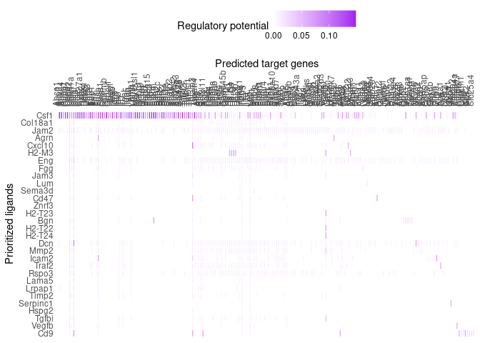
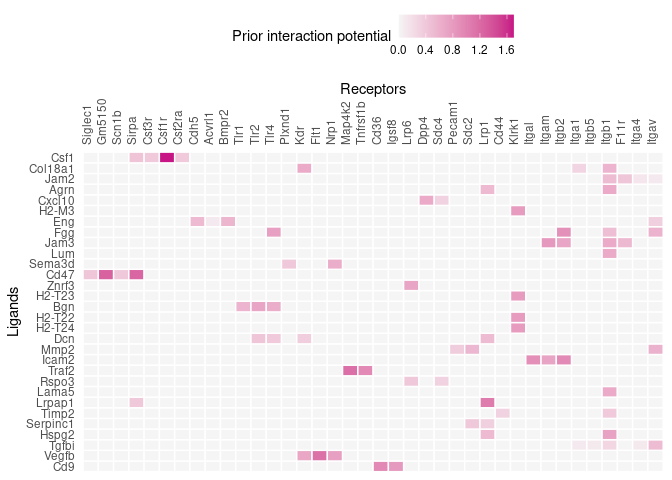
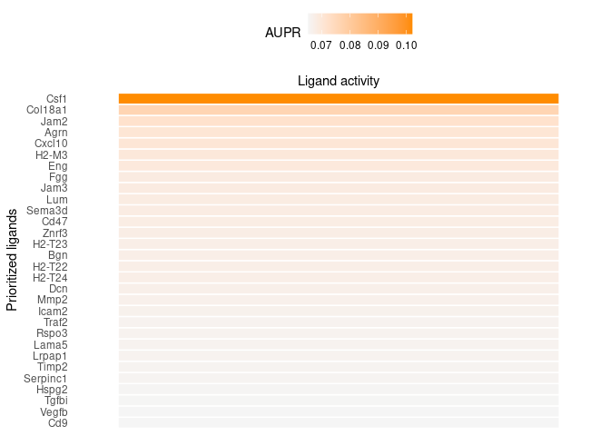
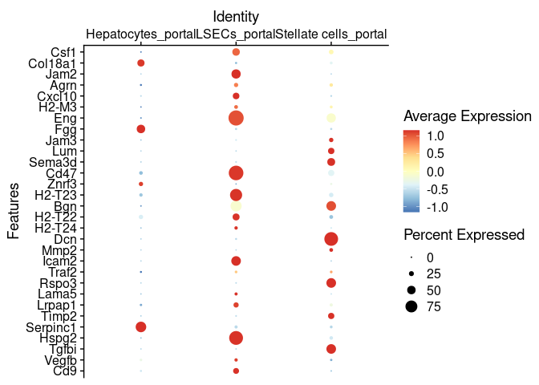
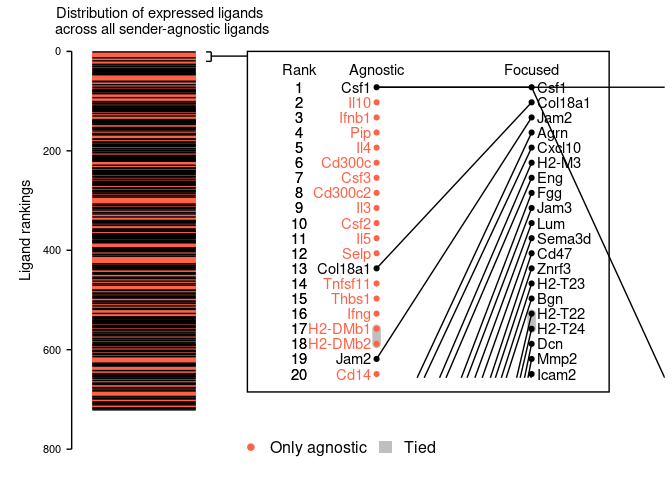
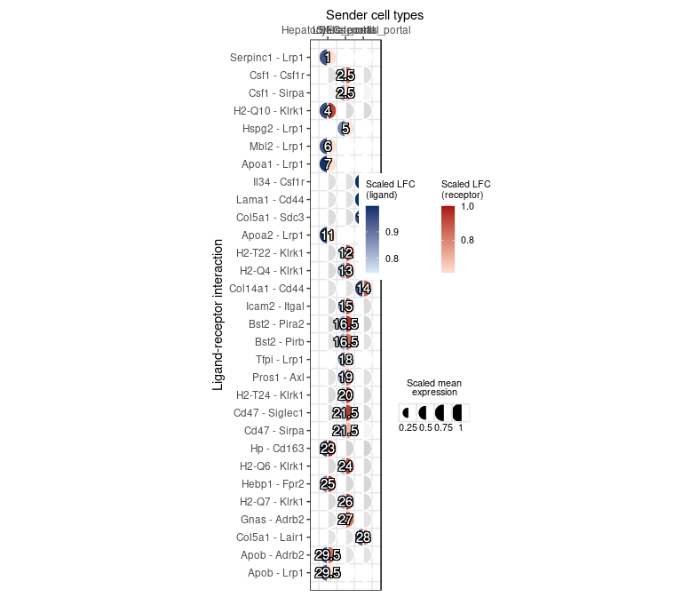

In this tutorial, we will demonstrate the procedure for the scenario where you want to explore cell-cell communication differences between cell types, instead of  between two conditions of the same cell type. This corresponds to the "Cell Localization" scenario in the flowchart below:

{width=75%}

### Loading data

We will be using the mouse liver scRNA-seq data generated in the [Guilliams et al (2022) paper](https://www.sciencedirect.com/science/article/pii/S0092867421014811). A subset of this data will be used for this tutorial, available on Zenodo at [https://zenodo.org/records/5840787]. The full dataset can be accessed at the [Liver Cell Atlas](https://livercellatlas.org/).

We will look at cell-cell communication differences between Kupffer cells, the resident liver macrophages, and bile duct and capsule macrophages. This means that we are interested in identifying the Kupffer cell-specific ligands important for its identity.


``` r
options(timeout = 3600) # increase time limit for downloading the data 
seuratObj <- readRDS(url("https://zenodo.org/records/5840787/files/seurat_obj_subset_integrated_zonation.rds")) 
```

### Loading mouse networks


``` r
zenodo_path <- "https://zenodo.org/record/7074291/files/" 

ligand_target_matrix <- readRDS(url(paste0(zenodo_path, "ligand_target_matrix_nsga2r_final_mouse.rds"))) 
lr_network <- readRDS(url(paste0(zenodo_path, "lr_network_mouse_21122021.rds"))) 
weighted_networks <- readRDS(url(paste0(zenodo_path, "weighted_networks_nsga2r_final_mouse.rds"))) 
```


# Procedure

The gene set of interest is chosen as the DE genes between Kupffer cells and other macrophages, while the background gene set is the entire genome.

## Feature extraction

1. Load required libraries.


``` r
library(nichenetr)
library(Seurat) 
library(tidyverse) 
```

2. *(Optional)* For older Seurat objects, update it to be compatible with the currently installed Seurat version.


``` r
seuratObj <- UpdateSeuratObject(seuratObj)
DefaultAssay(seuratObj) <- "SCT"

seuratObj
```

```
## An object of class Seurat 
## 41774 features across 10670 samples within 3 assays 
## Active assay: SCT (18329 features, 0 variable features)
##  3 layers present: counts, data, scale.data
##  2 other assays present: RNA, integrated
##  2 dimensional reductions calculated: pca, umap
```

3. Set the cell type annotation column as the identity of the Seurat object.


``` r
Idents(seuratObj) <- seuratObj$celltype 
```

4. Define a "receiver" cell population. The receiver cell population can only consist of one cell type.


``` r
receiver <- "KCs" 
```

5. Determine which genes are expressed in the receiver cell population. The function `get_expressed_genes` considers genes to be expressed if they have non-zero counts in a certain percentage of the cell population (by default set at 10%). Users are also free to define expressed genes differently in a way that fits their data.  


``` r
expressed_genes_receiver <- get_expressed_genes(receiver, seuratObj,  pct = 0.1)

# Preview
length(expressed_genes_receiver)
```

```
## [1] 5298
```

``` r
head(expressed_genes_receiver)
```

```
## [1] "Mrpl15"  "Lypla1"  "Tcea1"   "Atp6v1h" "Rb1cc1"  "Pcmtd1"
```

6. Get a list of all receptors available in the ligand-receptor network, and define expressed receptors as genes that are in the ligand-receptor network and expressed in the receiver.


``` r
all_receptors <- unique(lr_network$to)  
expressed_receptors <- intersect(all_receptors, expressed_genes_receiver) 

# Preview
length(expressed_receptors)
```

```
## [1] 207
```

``` r
head(expressed_receptors)
```

```
## [1] "Itgal"     "F11r"      "Mgrn1"     "Lrp1"      "Tnfrsf11a" "App"
```

7. Define the potential ligands as all ligands whose cognate receptors are expressed.


``` r
potential_ligands <- lr_network[lr_network$to %in% expressed_receptors, ] 
potential_ligands <- unique(potential_ligands$from) 

# Preview
length(potential_ligands)
```

```
## [1] 721
```

``` r
head(potential_ligands)
```

```
## [1] "9530003J23Rik" "a"             "A2m"           "Ace2"         
## [5] "Adam10"        "Adam11"
```

8. *(Optional)* For the sender-focused approach, define sender cell types and expressed genes in all populations combined. Then, filter potential ligands to those that are expressed in sender cells.


``` r
sender_celltypes <- c("LSECs_portal", "Hepatocytes_portal", "Stellate cells_portal") 
list_expressed_genes_sender <- lapply(sender_celltypes, function(celltype) {
    get_expressed_genes(celltype, seuratObj, pct = 0.1)
  }) 
expressed_genes_sender <- unique(unlist(list_expressed_genes_sender)) 
potential_ligands_focused <- intersect(potential_ligands, expressed_genes_sender) 

# Preview
length(expressed_genes_sender)
```

```
## [1] 8743
```

``` r
head(expressed_genes_sender)
```

```
## [1] "Sox17"   "Mrpl15"  "Lypla1"  "Tcea1"   "Atp6v1h" "Rb1cc1"
```

``` r
length(potential_ligands_focused)
```

```
## [1] 247
```

``` r
head(potential_ligands_focused)
```

```
## [1] "Adam10" "Adam12" "Adam15" "Adam17" "Adam9"  "Adgre5"
```


TODO. Define the gene set of interest that represents the cell-cell communication event to be studied. Perform DE analysis between the cell type of interest and other localizations of the cell type. Finally, define the gene set of interest as significantly DE genes, i.e., genes with adjusted p-value lower than or equal to 0.05 and absolute log-fold change greater than 0.25.

By default, both genes that are up and downregulated are considered. Users can choose to focus on only one direction (typically upregulation) by removing the `abs()` function and adjusting the equality term to either \>= 0.25 or \<= -0.25 for up and downregulation, respectively. We recommend the gene set of interest to contain between 20 and 2000 genes for optimal ligand activity prediction. Moreover, the number of background genes should be sufficiently greater than those of the gene set of interest.


``` r
seuratObj <- PrepSCTFindMarkers(seuratObj, assay = "SCT", verbose = TRUE)
```

```
## Found 3 SCT models. Recorrecting SCT counts using minimum median counts: 2591.5
```

``` r
DE_table_receiver <- FindMarkers(seuratObj, ident.1 = receiver, ident.2 = c('MoMac1', 'MoMac2'),
                                 min.pct = 0.1, assay="SCT") 

geneset_oi <- DE_table_receiver[DE_table_receiver$p_val_adj <= 0.05 & abs(DE_table_receiver$avg_log2FC) >= 0.25, ] 
geneset_oi <- rownames(geneset_oi)[rownames(geneset_oi) %in% rownames(ligand_target_matrix)] 

# Preview
length(geneset_oi)
```

```
## [1] 1767
```

``` r
head(geneset_oi)
```

```
## [1] "Cd5l"   "Vsig4"  "Fcna"   "Clec4f" "C6"     "Folr2"
```


11. Determine background genes as all genes in the genome that are also in the ligand-target matrix.


``` r
background_expressed_genes <- rownames(seuratObj)[rownames(seuratObj) %in% rownames(ligand_target_matrix)] 

# Preview
length(background_expressed_genes)
```

```
## [1] 15233
```

``` r
head(background_expressed_genes)
```

```
## [1] "Xkr4"    "Sox17"   "Mrpl15"  "Lypla1"  "Tcea1"   "Atp6v1h"
```

## Ligand activity analysis and downstream prediction

12. Perform the ligand activity analysis, then sort the ligands based on the area under the precision-recall curve (AUPR).


``` r
ligand_activities <- predict_ligand_activities(
  geneset = geneset_oi,
  background_expressed_genes = background_expressed_genes,
  ligand_target_matrix = ligand_target_matrix,
  potential_ligands = potential_ligands) 

ligand_activities <- ligand_activities[order(ligand_activities$aupr_corrected, 	decreasing = TRUE), ] 

# Preview
dim(ligand_activities)
```

```
## [1] 721   5
```

``` r
head(ligand_activities)
```

```
## # A tibble: 6 × 5
##   test_ligand auroc  aupr aupr_corrected pearson
##   <chr>       <dbl> <dbl>          <dbl>   <dbl>
## 1 Csf1        0.679 0.218         0.102    0.161
## 2 Il10        0.659 0.199         0.0829   0.141
## 3 Ifnb1       0.656 0.197         0.0812   0.126
## 4 Pip         0.661 0.195         0.0792   0.177
## 5 Il4         0.659 0.195         0.0785   0.131
## 6 Cd300c      0.652 0.194         0.0779   0.164
```

13. *(Optional)* If performing the sender-focused approach, subset the ligand activities to only contain expressed ligands.
**Note:** When using the sender-agnostic approach, simply replace `ligand_activities` with `ligand_activities_all` in Steps 14 and 20.


``` r
ligand_activities_all <- ligand_activities 
ligand_activities <- ligand_activities[ligand_activities$test_ligand %in% potential_ligands_focused, ] 

# Preview
dim(ligand_activities)
```

```
## [1] 247   5
```

``` r
head(ligand_activities)
```

```
## # A tibble: 6 × 5
##   test_ligand auroc  aupr aupr_corrected pearson
##   <chr>       <dbl> <dbl>          <dbl>   <dbl>
## 1 Csf1        0.679 0.218         0.102   0.161 
## 2 Col18a1     0.657 0.192         0.0763  0.157 
## 3 Jam2        0.640 0.188         0.0719  0.162 
## 4 Agrn        0.647 0.186         0.0704  0.144 
## 5 Cxcl10      0.652 0.186         0.0704  0.115 
## 6 H2-M3       0.654 0.186         0.0696  0.0911
```

14. Obtain the names of the top 30 ligands.


``` r
best_upstream_ligands <- top_n(ligand_activities, 30, aupr_corrected)$test_ligand 
 
# Preview
length(best_upstream_ligands)
```

```
## [1] 30
```

``` r
head(best_upstream_ligands)
```

```
## [1] "Csf1"    "Col18a1" "Jam2"    "Agrn"    "Cxcl10"  "H2-M3"
```

15. Infer which genes in the gene set of interest have the highest regulatory potential for each top-ranked ligand. The function get_weighted_ligand_target_links will return genes that are in the gene set of interest and are the top `n` targets of a ligand (default: `n = 200`).


``` r
active_ligand_target_links_df <- lapply(best_upstream_ligands,
                                        get_weighted_ligand_target_links, 
                                        geneset = geneset_oi, 
                                        ligand_target_matrix = ligand_target_matrix, 
                                        n = 200) 

active_ligand_target_links_df <- drop_na(bind_rows(active_ligand_target_links_df)) 

# Preview
dim(active_ligand_target_links_df)
```

```
## [1] 1482    3
```

``` r
head(active_ligand_target_links_df)
```

```
## # A tibble: 6 × 3
##   ligand target weight
##   <chr>  <chr>   <dbl>
## 1 Csf1   Abca1  0.144 
## 2 Csf1   Acp2   0.143 
## 3 Csf1   Anxa4  0.0793
## 4 Csf1   Apoc1  0.144 
## 5 Csf1   Capg   0.145 
## 6 Csf1   Ccnd1  0.0811
```

16. Similarly, identify which receptors have the highest interaction potential with the top-ranked ligands.


``` r
ligand_receptor_links_df <- get_weighted_ligand_receptor_links(
  best_upstream_ligands, expressed_receptors,
  lr_network, weighted_networks$lr_sig) 

# Preview
dim(ligand_receptor_links_df)
```

```
## [1] 75  3
```

``` r
head(ligand_receptor_links_df)
```

```
## # A tibble: 6 × 3
##   from  to     weight
##   <chr> <chr>   <dbl>
## 1 Agrn  Itgb1   0.667
## 2 Agrn  Lrp1    0.525
## 3 Bgn   Tlr1    0.575
## 4 Bgn   Tlr2    0.712
## 5 Bgn   Tlr4    0.632
## 6 Cd47  Gm5150  1.27
```

## Visualizations

Visualizations covered in this section include: heatmaps of ligand-target regulatory potential (Steps 17-18), ligand-receptor interaction potential (Step 19), ligand activity (Step 20), and log-fold change of ligands between treatment conditions (Steps 21-22); a dot plot of cell type expression and percentage (Step 23); a line plot comparing ligand rankings between the sender-agnostic and -focused approach (Step 24); chord diagrams (Steps 25-29); and a signaling graph (Steps 30-31). This section can be followed in its entirety only for the sender-focused approach (i.e., if all optional code in the previous sections have been executed); for the sender-agnostic approach, only Steps 17-20 and Steps 30-31 are relevant.

17. Prepare the weighted ligand-target data frame for visualization by transforming it into matrix. By default, regulatory potentials lower than the 25th percentile are set to zero for visualization clarity. This cutoff parameter can freely be tuned by the user.


``` r
active_ligand_target_links <- prepare_ligand_target_visualization(
  ligand_target_df = active_ligand_target_links_df,
  ligand_target_matrix = ligand_target_matrix,
  cutoff = 0.5) 
```

18. Order the rows to follow the rankings of the ligands, and the columns alphabetically.


``` r
order_ligands <- rev(intersect(best_upstream_ligands, colnames(active_ligand_target_links))) 
order_targets <- intersect(unique(active_ligand_target_links_df$target), rownames(active_ligand_target_links)) 

vis_ligand_target <- t(active_ligand_target_links[order_targets,order_ligands])

(make_heatmap_ggplot(vis_ligand_target, y_name = "Prioritized ligands", x_name = "Predicted target genes",
                     color = "purple", legend_title = "Regulatory potential") + 
    scale_fill_gradient2(low = "whitesmoke",  high = "purple")) 
```

```
## Scale for fill is already present.
## Adding another scale for fill, which will replace the existing scale.
```

<!-- -->

19. Create a heatmap for ligand-receptor interactions.


``` r
vis_ligand_receptor_network <- prepare_ligand_receptor_visualization(
  ligand_receptor_links_df, best_upstream_ligands,
  order_hclust = "receptors") 

(make_heatmap_ggplot(t(vis_ligand_receptor_network), 
                     y_name = "Ligands", x_name = "Receptors",  
                     color = "mediumvioletred", legend_title = "Prior interaction potential")) 
```

<!-- -->

20. Create a heatmap of the ligand activity measure.


``` r
ligand_aupr_matrix <- column_to_rownames(ligand_activities, "test_ligand") 
ligand_aupr_matrix <- ligand_aupr_matrix[rev(best_upstream_ligands), "aupr_corrected", drop=FALSE] 
vis_ligand_aupr <- as.matrix(ligand_aupr_matrix, ncol = 1) 

(make_heatmap_ggplot(vis_ligand_aupr,
                     "Prioritized ligands", "Ligand activity", 
                     legend_title = "AUPR", color = "darkorange") + 
    theme(axis.text.x.top = element_blank()))  
```

<!-- -->

23. Create a dot plot showing the average expression of ligands per cell type, as well as the percentage of cells from the cell type expressing the ligands (Figure 3e).


``` r
DotPlot(subset(seuratObj, celltype %in% sender_celltypes),
        features = rev(best_upstream_ligands), cols = "RdYlBu") + 
  coord_flip() +
  scale_y_discrete(position = "right") 
```

```
## Warning: Scaling data with a low number of groups may produce misleading
## results
```

<!-- -->

24. *(Optional)* Create a line plot comparing the rankings between the sender-agnostic and sender-focused approach.


``` r
(make_line_plot(ligand_activities = ligand_activities_all,
                potential_ligands = potential_ligands_focused) +
   theme(plot.title = element_text(size=11, hjust=0.1, margin=margin(0, 0, -5, 0))))
```

<!-- -->

## Prioritization of ligand-receptor pairs

This section is only applicable for the sender-focused approach. Whereas Steps 12-14 only prioritize ligands based on ligand activity, this section incorporates relative expression and differential expression to further prioritize ligand-receptor pairs associated with specific sender and receiver cell types.

32. Filter the ligand-receptor network to only contain expressed interactions. 


``` r
lr_network_filtered <- filter(lr_network, from %in% potential_ligands_focused &
                                to %in% expressed_receptors)[, c("from", "to")]
```

33. Calculate the values required for prioritization, including DE between cell types, average expression, and DE between conditions. To use the wrapper function, follow option A. To calculate these values step-by-step, follow option B.


A. **Using the wrapper function.**

(i) Run the wrapper function. 


``` r
info_tables <- generate_info_tables( 
    #subset(seuratObj, idents = c(sender_celltypes, receiver)), 
    seuratObj,
    celltype_colname = "celltype", 
    senders_oi = sender_celltypes, 
    receivers_oi = receiver, 
    lr_network = lr_network_filtered,
    scenario = "one_condition"
) 
```

```
## Warning in generate_info_tables(seuratObj, celltype_colname = "celltype", :
## condition_* arguments are provided but the 'one_condition' scenario is
## selected. Only cells from the condition_oi will be used to calculate cell type
## specificity, condition specificity will not be calculated.
```

```
## Calculating cluster Capsule fibroblasts
```

```
## Calculating cluster Central Vein Endothelial cells
```

```
## Calculating cluster Cholangiocytes
```

```
## Calculating cluster Fibroblast 1
```

```
## Calculating cluster Hepatocytes_central
```

```
## Calculating cluster Hepatocytes_portal
```

```
## Calculating cluster KCs
```

```
## Calculating cluster LSECs_central
```

```
## Calculating cluster LSECs_portal
```

```
## Calculating cluster Mesothelial cells
```

```
## Calculating cluster MoMac1
```

```
## Calculating cluster MoMac2
```

```
## Calculating cluster Fibroblast 2
```

```
## Calculating cluster Stellate cells_portal
```

```
## Calculating cluster Stellate cells_central
```

```
## As of Seurat v5, we recommend using AggregateExpression to perform pseudo-bulk analysis.
## Names of identity class contain underscores ('_'), replacing with dashes ('-')
## This message is displayed once per session.
```

(ii) Assign the output of the wrapper function to variables. 


``` r
processed_DE_table <- info_tables$sender_receiver_de  
processed_expr_table <- info_tables$sender_receiver_info %>% 
  # Replace '-' in senders with '_'
  mutate(sender = gsub("-", "_", sender))

# Preview
dim(processed_DE_table)
```

```
## [1] 1632   13
```

``` r
head(processed_DE_table)
```

```
##                  sender receiver  ligand receptor lfc_ligand lfc_receptor
## 1    Hepatocytes_portal      KCs      Hp    Cd163   4.017203     7.500683
## 2    Hepatocytes_portal      KCs   Timd2    Timd4   2.886659     7.443472
## 3 Stellate cells_portal      KCs Angptl2    Pira2   4.000064     5.030304
## 4 Stellate cells_portal      KCs  Lrrc4c  Siglece   4.549855     4.472624
## 5 Stellate cells_portal      KCs    Il34    Csf1r   5.369896     3.509137
## 6 Stellate cells_portal      KCs   Lama1     Cd44   5.286267     3.407183
##   ligand_receptor_lfc_avg  p_val_ligand  p_adj_ligand p_val_receptor
## 1                5.758943  0.000000e+00  0.000000e+00              0
## 2                5.165066 4.590444e-292 8.720007e-288              0
## 3                4.515184 2.061570e-235 3.916158e-231              0
## 4                4.511240  0.000000e+00  0.000000e+00              0
## 5                4.439516  0.000000e+00  0.000000e+00              0
## 6                4.346725  0.000000e+00  0.000000e+00              0
##   p_adj_receptor pct_expressed_sender pct_expressed_receiver
## 1              0                0.550                  0.630
## 2              0                0.351                  0.749
## 3              0                0.495                  0.558
## 4              0                0.650                  0.652
## 5              0                0.586                  0.880
## 6              0                0.589                  0.815
```

``` r
dim(processed_expr_table)
```

```
## [1] 122400      7
```

``` r
head(processed_expr_table)
```

```
## # A tibble: 6 × 7
##   sender   receiver ligand receptor avg_ligand avg_receptor ligand_receptor_prod
##   <chr>    <chr>    <chr>  <chr>         <dbl>        <dbl>                <dbl>
## 1 Central… MoMac1   App    Cd74          14.9         393.                 5836.
## 2 Stellat… LSECs-c… Dcn    Kdr          174.           32.4                5631.
## 3 Stellat… LSECs-p… Dcn    Kdr          174.           30.1                5231.
## 4 MoMac1   Central… Apoe   App          329.           14.9                4891.
## 5 LSECs_c… MoMac1   App    Cd74          10.2         393.                 3989.
## 6 Cholang… MoMac1   App    Cd74           9.21        393.                 3618.
```
 
34. Generate the prioritization table containing rankings of cell-type-specific, ligand-receptor interactions. The "case_control" scenario sets all weights to one, while the "one_condition" scenario sets condition specificity to zero and the remaining weights to one.


``` r
prioritized_table <- generate_prioritization_tables(
  processed_expr_table,
  processed_DE_table,
  ligand_activities,
  scenario = "one_condition") 
```

```
## Joining with `by = join_by(sender, receiver, ligand, receptor)`
## Joining with `by = join_by(sender, ligand, lfc_ligand, p_val_ligand)`
## Joining with `by = join_by(ligand)`
## Joining with `by = join_by(receiver, receptor, lfc_receptor, p_val_receptor)`
## Joining with `by = join_by(sender, ligand, avg_ligand)`
## Joining with `by = join_by(receiver, receptor, avg_receptor)`
```

``` r
# Preview
dim(prioritized_table)
```

```
## [1] 1632   35
```

``` r
head(prioritized_table)
```

```
## # A tibble: 6 × 35
##   sender receiver ligand receptor lfc_ligand lfc_receptor ligand_receptor_lfc_…¹
##   <chr>  <chr>    <chr>  <chr>         <dbl>        <dbl>                  <dbl>
## 1 Hepat… KCs      Serpi… Lrp1           3.25         1.58                   2.41
## 2 LSECs… KCs      Csf1   Csf1r          1.50         3.51                   2.50
## 3 LSECs… KCs      Csf1   Sirpa          1.50         1.85                   1.67
## 4 Hepat… KCs      H2-Q10 Klrk1          3.53         4.05                   3.79
## 5 LSECs… KCs      Hspg2  Lrp1           2.08         1.58                   1.83
## 6 Hepat… KCs      Mbl2   Lrp1           3.16         1.58                   2.37
## # ℹ abbreviated name: ¹​ligand_receptor_lfc_avg
## # ℹ 28 more variables: p_val_ligand <dbl>, p_adj_ligand <dbl>,
## #   p_val_receptor <dbl>, p_adj_receptor <dbl>, pct_expressed_sender <dbl>,
## #   pct_expressed_receiver <dbl>, avg_ligand <dbl>, avg_receptor <dbl>,
## #   ligand_receptor_prod <dbl>, lfc_pval_ligand <dbl>,
## #   p_val_ligand_adapted <dbl>, scaled_lfc_ligand <dbl>,
## #   scaled_p_val_ligand <dbl>, scaled_lfc_pval_ligand <dbl>, …
```

35. Create a mushroom plot depicting ligand expression on one semicircle, and receptor expression on the other (Figure 3i).


``` r
legend_adjust <- c(0.8, 0.7)
make_mushroom_plot(prioritized_table, top_n = 30,
                   show_all_datapoints = TRUE,
                   true_color_range = TRUE,
                   show_rankings = TRUE,
                   legend.title = element_text(size=8),
                   legend.text = element_text(size=8),
                   legend.key.size = unit(4, 'mm')) +
  theme(legend.justification = legend_adjust,
        axis.title.x = element_text(hjust = 0.25))
```

<!-- -->

**Session info**


``` r
sessionInfo()
```

```
## R version 4.3.3 (2024-02-29)
## Platform: x86_64-pc-linux-gnu (64-bit)
## Running under: CentOS Stream 8
## 
## Matrix products: default
## BLAS/LAPACK: /usr/lib64/libopenblasp-r0.3.15.so;  LAPACK version 3.9.0
## 
## locale:
##  [1] LC_CTYPE=en_US.UTF-8       LC_NUMERIC=C              
##  [3] LC_TIME=en_US.UTF-8        LC_COLLATE=en_US.UTF-8    
##  [5] LC_MONETARY=en_US.UTF-8    LC_MESSAGES=en_US.UTF-8   
##  [7] LC_PAPER=en_US.UTF-8       LC_NAME=C                 
##  [9] LC_ADDRESS=C               LC_TELEPHONE=C            
## [11] LC_MEASUREMENT=en_US.UTF-8 LC_IDENTIFICATION=C       
## 
## time zone: Europe/Brussels
## tzcode source: system (glibc)
## 
## attached base packages:
## [1] stats     graphics  grDevices utils     datasets  methods   base     
## 
## other attached packages:
##  [1] lubridate_1.9.3    forcats_1.0.0      stringr_1.5.1      dplyr_1.1.4       
##  [5] purrr_1.0.2        readr_2.1.5        tidyr_1.3.1        tibble_3.2.1      
##  [9] ggplot2_3.5.1      tidyverse_2.0.0    Seurat_5.1.0       SeuratObject_5.0.2
## [13] sp_2.1-4           nichenetr_2.1.0   
## 
## loaded via a namespace (and not attached):
##   [1] RcppAnnoy_0.0.22       splines_4.3.3          later_1.3.2           
##   [4] bitops_1.0-7           polyclip_1.10-6        hardhat_1.3.1         
##   [7] pROC_1.18.5            rpart_4.1.23           fastDummies_1.7.3     
##  [10] lifecycle_1.0.4        doParallel_1.0.17      globals_0.16.3        
##  [13] lattice_0.22-5         MASS_7.3-60.0.1        backports_1.4.1       
##  [16] magrittr_2.0.3         limma_3.58.1           Hmisc_5.1-2           
##  [19] plotly_4.10.4          sass_0.4.9             rmarkdown_2.27        
##  [22] jquerylib_0.1.4        yaml_2.3.8             httpuv_1.6.15         
##  [25] sctransform_0.4.1      spam_2.10-0            spatstat.sparse_3.0-3 
##  [28] reticulate_1.37.0      cowplot_1.1.3          pbapply_1.7-2         
##  [31] RColorBrewer_1.1-3     abind_1.4-5            Rtsne_0.17            
##  [34] presto_1.0.0           BiocGenerics_0.48.1    nnet_7.3-19           
##  [37] tweenr_2.0.3           ipred_0.9-14           circlize_0.4.16       
##  [40] lava_1.8.0             IRanges_2.36.0         S4Vectors_0.40.2      
##  [43] ggrepel_0.9.5          irlba_2.3.5.1          listenv_0.9.1         
##  [46] spatstat.utils_3.0-4   goftest_1.2-3          RSpectra_0.16-1       
##  [49] spatstat.random_3.2-3  fitdistrplus_1.1-11    parallelly_1.37.1     
##  [52] leiden_0.4.3.1         codetools_0.2-19       ggforce_0.4.2         
##  [55] tidyselect_1.2.1       shape_1.4.6.1          farver_2.1.2          
##  [58] base64enc_0.1-3        matrixStats_1.3.0      stats4_4.3.3          
##  [61] spatstat.explore_3.2-7 jsonlite_1.8.8         caret_6.0-94          
##  [64] GetoptLong_1.0.5       e1071_1.7-14           Formula_1.2-5         
##  [67] progressr_0.14.0       ggridges_0.5.6         survival_3.5-8        
##  [70] iterators_1.0.14       foreach_1.5.2          tools_4.3.3           
##  [73] ggnewscale_0.4.10      ica_1.0-3              Rcpp_1.0.12           
##  [76] glue_1.7.0             prodlim_2023.08.28     gridExtra_2.3         
##  [79] xfun_0.44              withr_3.0.0            fastmap_1.2.0         
##  [82] fansi_1.0.6            caTools_1.18.2         digest_0.6.35         
##  [85] timechange_0.3.0       R6_2.5.1               mime_0.12             
##  [88] colorspace_2.1-0       scattermore_1.2        tensor_1.5            
##  [91] spatstat.data_3.0-4    DiagrammeR_1.0.11      utf8_1.2.4            
##  [94] generics_0.1.3         data.table_1.15.4      recipes_1.0.10        
##  [97] class_7.3-22           httr_1.4.7             htmlwidgets_1.6.4     
## [100] uwot_0.2.2             ModelMetrics_1.2.2.2   pkgconfig_2.0.3       
## [103] gtable_0.3.5           timeDate_4032.109      ComplexHeatmap_2.18.0 
## [106] lmtest_0.9-40          shadowtext_0.1.3       htmltools_0.5.8.1     
## [109] dotCall64_1.1-1        clue_0.3-65            scales_1.3.0          
## [112] png_0.1-8              gower_1.0.1            knitr_1.46            
## [115] rstudioapi_0.16.0      tzdb_0.4.0             reshape2_1.4.4        
## [118] rjson_0.2.21           checkmate_2.3.1        visNetwork_2.1.2      
## [121] nlme_3.1-164           proxy_0.4-27           cachem_1.1.0          
## [124] zoo_1.8-12             GlobalOptions_0.1.2    KernSmooth_2.23-22    
## [127] parallel_4.3.3         miniUI_0.1.1.1         foreign_0.8-86        
## [130] pillar_1.9.0           grid_4.3.3             vctrs_0.6.5           
## [133] RANN_2.6.1             randomForest_4.7-1.1   promises_1.3.0        
## [136] xtable_1.8-4           cluster_2.1.6          htmlTable_2.4.2       
## [139] evaluate_0.23          cli_3.6.2              compiler_4.3.3        
## [142] rlang_1.1.3            crayon_1.5.2           future.apply_1.11.2   
## [145] labeling_0.4.3         fdrtool_1.2.17         plyr_1.8.9            
## [148] stringi_1.8.4          viridisLite_0.4.2      deldir_2.0-4          
## [151] munsell_0.5.1          lazyeval_0.2.2         spatstat.geom_3.2-9   
## [154] Matrix_1.6-5           RcppHNSW_0.6.0         hms_1.1.3             
## [157] patchwork_1.2.0        future_1.33.2          statmod_1.5.0         
## [160] shiny_1.8.1.1          highr_0.10             ROCR_1.0-11           
## [163] igraph_2.0.3           bslib_0.7.0
```
