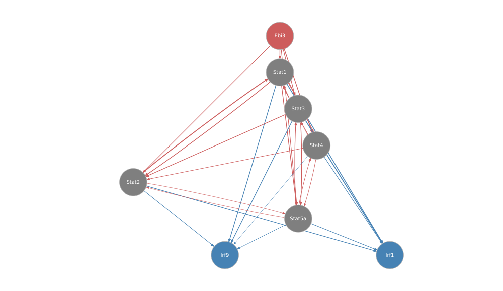

NicheNet training: case-control study example
================
2024-05-31


Before starting this tutorial, please make sure you have installed NicheNet and downloaded the required data and networks, as described in the README file. The data and networks are assumed to be stored in the `data/` and `networks/` folder relative to to the project file. You can check your working directory with `getwd()` and set it with `setwd()`. 

### Load data and networks

In this case study, we will use mouse NICHE-seq data from Medaglia et al. (2017) to explore intercellular communication in the T cell area in the inguinal lymph node before and 72 hours after lymphocytic choriomeningitis virus (LCMV) infection. Specifically, we will prioritize which ligands can best explain the downstream changes after LCMV infection in CD8 T cells as the receiver population. This dataset contains 13,541 genes and 5,027 cells from 6 cell populations: CD4 T cells (including regulatory T cells), CD8 T cells, B cells, NK cells, dendritic cells (DCs) and inflammatory monocytes.


``` r
seuratObj <- readRDS("data/seuratObj.rds")
```


Three networks are required to run the NicheNet analysis: the ligand-target prior model, the ligand-receptor network, and the weighted ligand-receptor network. We provide these networks with either human or mouse gene symbols, but as this study was performed in mouse, we will use the mouse networks. 


``` r
ligand_target_matrix <- readRDS("networks/ligand_target_matrix_nsga2r_final_mouse.rds")
lr_network <- readRDS("networks/lr_network_mouse_21122021.rds")
weighted_networks <- readRDS("networks/weighted_networks_nsga2r_final_mouse.rds")

ligand_target_matrix[1:5, 1:5] # target genes in rows, ligands in columns
```

```
##               2300002M23Rik 2610528A11Rik 9530003J23Rik            a
## 0610005C13Rik  0.000000e+00  0.000000e+00  1.311297e-05 0.000000e+00
## 0610009B22Rik  0.000000e+00  0.000000e+00  1.269301e-05 0.000000e+00
## 0610009L18Rik  8.872902e-05  4.977197e-05  2.581909e-04 7.570125e-05
## 0610010F05Rik  2.194046e-03  1.111556e-03  3.142374e-03 1.631658e-03
## 0610010K14Rik  2.271606e-03  9.360769e-04  3.546140e-03 1.697713e-03
##                        A2m
## 0610005C13Rik 1.390053e-05
## 0610009B22Rik 1.345536e-05
## 0610009L18Rik 9.802264e-05
## 0610010F05Rik 2.585820e-03
## 0610010K14Rik 2.632082e-03
```

``` r
head(lr_network)
```

```
##            from    to database   source
## 1 2300002M23Rik  Ddr1 omnipath omnipath
## 2 2610528A11Rik Gpr15 omnipath omnipath
## 3 9530003J23Rik Itgal omnipath omnipath
## 4             a  Atrn omnipath omnipath
## 5             a  F11r omnipath omnipath
## 6             a  Mc1r omnipath omnipath
```

``` r
head(weighted_networks$lr_sig) # interactions and their weights in the ligand-receptor + signaling network
```

```
##            from     to     weight
## 1 0610010F05Rik    App 0.10989552
## 2 0610010F05Rik    Cat 0.06732398
## 3 0610010F05Rik   H1f2 0.06601048
## 4 0610010F05Rik Lrrc49 0.08288421
## 5 0610010F05Rik  Nicn1 0.08639550
## 6 0610010F05Rik  Srpk1 0.12290087
```

The ligand-target prior model is a matrix describing the potential that a ligand may regulate a target gene, and it is used to run the ligand activity analysis. The ligand-receptor network contains information on potential ligand-receptor bindings, and it is used to identify potential ligands. Finally, the weighted ligand-receptor network contains weights representing the potential that a ligand will bind to a receptor, and it is used for visualization.

These networks were translated from human to mouse gene names using one-to-one orthologs when feasible, and one-to-many conversion was allowed when necessary (for instance, when one human gene symbol corresponded to two mouse gene symbols). Users that are interested in building prior models for other organisms can either create an organism-specific model using data sources relevant to that organism, or use the existing human NicheNet model to convert human gene symbols to their corresponding one-to-one orthologs in the organism of interest. However, this decision depends on one hand, the availability of data for the organism of interest and on the other, the homology between humans and the organism of interest. For instance, using the human model and converting gene symbols might work for primates, but creating a new model from species-specific data sources is better suited for organisms like Drosophila.

## Part I. Basic NicheNet analysis

Here, we describe the procedure for both the sender-focused and sender-agnostic approach, as shown here:


{width=75%}

As two conditions are present in this example dataset, the gene set of interest is chosen as the DE genes between these conditions in the receiver cell type. Box 2 details the use of wrapper functions that can automatically run Steps 5-23.

### Feature extraction

1. Load required libraries.


``` r
library(nichenetr)
library(Seurat) 
library(tidyverse) 
```

2. *(Optional)* For older Seurat objects, update it to be compatible with the currently installed Seurat version.


``` r
seuratObj <- UpdateSeuratObject(seuratObj)

seuratObj
```

```
## An object of class Seurat 
## 13541 features across 5027 samples within 1 assay 
## Active assay: RNA (13541 features, 1575 variable features)
##  3 layers present: counts, data, scale.data
##  4 dimensional reductions calculated: cca, cca.aligned, tsne, pca
```

3. Set the cell type annotation column as the identity of the Seurat object.


``` r
Idents(seuratObj) <- seuratObj$celltype 
```

4. Define a "receiver" cell population. The receiver cell population can only consist of one cell type.


``` r
receiver <- "CD8 T" 
```

5. Determine which genes are expressed in the receiver cell population. The function `get_expressed_genes` considers genes to be expressed if they have non-zero counts in a certain percentage of the cell population (by default set at 10%). Here, we have lowered the threshold to 5% (`pct`) as some of the ligands and receptors are very lowly expressed. Users are also free to define expressed genes differently in a way that fits their data.  


``` r
expressed_genes_receiver <- get_expressed_genes(receiver, seuratObj,  pct = 0.05)

# Preview
length(expressed_genes_receiver)
```

```
## [1] 3903
```

``` r
head(expressed_genes_receiver)
```

```
## [1] "0610007C21Rik" "0610007L01Rik" "0610007P22Rik" "0610009D07Rik"
## [5] "0610010K14Rik" "0610012G03Rik"
```


6. Get a list of all receptors available in the ligand-receptor network, and define expressed receptors as genes that are in the ligand-receptor network and expressed in the receiver.


``` r
all_receptors <- unique(lr_network$to)  
expressed_receptors <- intersect(all_receptors, expressed_genes_receiver) 

# Preview
length(expressed_receptors)
```

```
## [1] 107
```

``` r
head(expressed_receptors)
```

```
## [1] "Itgal"   "Notch1"  "Tspan14" "Itga4"   "Itgb1"   "Il6ra"
```

7. Define the potential ligands as all ligands whose cognate receptors are expressed.


``` r
potential_ligands <- lr_network[lr_network$to %in% expressed_receptors, ] 
potential_ligands <- unique(potential_ligands$from) 

# Preview
length(potential_ligands)
```

```
## [1] 475
```

``` r
head(potential_ligands)
```

```
## [1] "9530003J23Rik" "Adam10"        "Adam11"        "Adam12"       
## [5] "Adam15"        "Adam17"
```

8. *(Optional)* For the sender-focused approach, define sender cell types and expressed genes in all populations combined. Then, filter potential ligands to those that are expressed in sender cells.


``` r
sender_celltypes <- c("CD4 T", "Treg", "Mono", "NK", "B", "DC") 
list_expressed_genes_sender <- lapply(sender_celltypes, function(celltype) {
    get_expressed_genes(celltype, seuratObj, pct = 0.05)
  }) 
expressed_genes_sender <- unique(unlist(list_expressed_genes_sender)) 
potential_ligands_focused <- intersect(potential_ligands, expressed_genes_sender) 

# Preview
length(expressed_genes_sender)
```

```
## [1] 8492
```

``` r
head(expressed_genes_sender)
```

```
## [1] "0610007C21Rik" "0610007L01Rik" "0610009D07Rik" "0610010K14Rik"
## [5] "0610012G03Rik" "1110002B05Rik"
```

``` r
length(potential_ligands_focused)
```

```
## [1] 122
```

``` r
head(potential_ligands_focused)
```

```
## [1] "Adam10" "Adam15" "Adam17" "Adam9"  "Alcam"  "Apoe"
```

9. Define the reference condition and condition of interest. The condition of interest is the condition after the CCC event has taken place, or the 'case' group in case-control studies. Here, it represents the condition after LCMV infection.


``` r
condition_oi <- "LCMV" 
condition_reference <- "SS" 
```

10. Define the gene set of interest that represents the cell-cell communication event to be studied. First, create a new Seurat object that only contains the receiver cell type. Then, perform DE analysis between the treatment conditions within the receiver cell type. Finally, define the gene set of interest as significantly DE genes, i.e., genes with adjusted p-value lower than or equal to 0.05 and absolute log-fold change greater than 0.25.

By default, both genes that are up and downregulated are considered. Users can choose to focus on only one direction (typically upregulation) by removing the `abs()` function and adjusting the equality term to either \>= 0.25 or \<= -0.25 for up and downregulation, respectively. We recommend the gene set of interest to contain between 20 and 2000 genes for optimal ligand activity prediction. Moreover, the number of background genes should be sufficiently greater than those of the gene set of interest.


``` r
seurat_obj_receiver <- subset(seuratObj, idents = receiver)
DE_table_receiver <- FindMarkers(object = seurat_obj_receiver,  
                                 ident.1 = condition_oi, ident.2 = condition_reference,
                                 group.by = "aggregate",
                                 min.pct = 0.05) 

geneset_oi <- DE_table_receiver[DE_table_receiver$p_val_adj <= 0.05 & abs(DE_table_receiver$avg_log2FC) >= 0.25, ] 
geneset_oi <- rownames(geneset_oi)[rownames(geneset_oi) %in% rownames(ligand_target_matrix)] 

# Preview
length(geneset_oi)
```

```
## [1] 241
```

``` r
head(geneset_oi)
```

```
## [1] "Ifi27l2b" "Irf7"     "Ly6a"     "Stat1"    "Ly6c2"    "Ifit3"
```

11. Determine background genes as all the genes expressed in the receiver cell type that are also in the ligand-target matrix.


``` r
background_expressed_genes <- expressed_genes_receiver[ 
expressed_genes_receiver %in% rownames(ligand_target_matrix)] 

# Preview
length(background_expressed_genes)
```

```
## [1] 3182
```

``` r
head(background_expressed_genes)
```

```
## [1] "0610010K14Rik" "0610012G03Rik" "1110004F10Rik" "1110038B12Rik"
## [5] "1110038F14Rik" "1600014C10Rik"
```

### Ligand activity analysis and downstream prediction

12. Perform the ligand activity analysis, then sort the ligands based on the area under the precision-recall curve (AUPR).


``` r
ligand_activities <- predict_ligand_activities(
  geneset = geneset_oi,
  background_expressed_genes = background_expressed_genes,
  ligand_target_matrix = ligand_target_matrix,
  potential_ligands = potential_ligands) 

ligand_activities <- ligand_activities[order(ligand_activities$aupr_corrected, 	decreasing = TRUE), ] 

# Preview
dim(ligand_activities)
```

```
## [1] 475   5
```

``` r
head(ligand_activities)
```

```
## # A tibble: 6 × 5
##   test_ligand auroc  aupr aupr_corrected pearson
##   <chr>       <dbl> <dbl>          <dbl>   <dbl>
## 1 Ifna1       0.713 0.418          0.342   0.483
## 2 Ifnl3       0.682 0.392          0.316   0.431
## 3 Ifnb1       0.708 0.387          0.312   0.418
## 4 Il27        0.676 0.378          0.303   0.433
## 5 Ifng        0.725 0.366          0.290   0.434
## 6 Ifnk        0.669 0.275          0.200   0.268
```

13. *(Optional)* If performing the sender-focused approach, subset the ligand activities to only contain expressed ligands.
**Note:** When using the sender-agnostic approach, simply replace `ligand_activities` with `ligand_activities_all` in Steps 14 and 20.


``` r
ligand_activities_all <- ligand_activities 
ligand_activities <- ligand_activities[ligand_activities$test_ligand %in% potential_ligands_focused, ] 

# Preview
dim(ligand_activities)
```

```
## [1] 122   5
```

``` r
head(ligand_activities)
```

```
## # A tibble: 6 × 5
##   test_ligand auroc  aupr aupr_corrected pearson
##   <chr>       <dbl> <dbl>          <dbl>   <dbl>
## 1 Il27        0.676 0.378          0.303   0.433
## 2 Ebi3        0.660 0.255          0.179   0.248
## 3 Tnf         0.668 0.203          0.127   0.240
## 4 Ptprc       0.659 0.193          0.117   0.162
## 5 H2-Eb1      0.655 0.188          0.112   0.175
## 6 H2-M3       0.634 0.188          0.112   0.187
```

14. Obtain the names of the top 30 ligands. Box 3 describes a method for assessing the quality of predicted ligands. 


``` r
best_upstream_ligands <- top_n(ligand_activities, 30, aupr_corrected)$test_ligand 
 
# Preview
length(best_upstream_ligands)
```

```
## [1] 30
```

``` r
head(best_upstream_ligands)
```

```
## [1] "Il27"   "Ebi3"   "Tnf"    "Ptprc"  "H2-Eb1" "H2-M3"
```

15. Infer which genes in the gene set of interest have the highest regulatory potential for each top-ranked ligand. The function get_weighted_ligand_target_links will return genes that are in the gene set of interest and are the top `n` targets of a ligand (default: `n = 200`).


``` r
active_ligand_target_links_df <- lapply(best_upstream_ligands,
                                        get_weighted_ligand_target_links, 
                                        geneset = geneset_oi, 
                                        ligand_target_matrix = ligand_target_matrix, 
                                        n = 200) 

active_ligand_target_links_df <- drop_na(bind_rows(active_ligand_target_links_df)) 

# Preview
dim(active_ligand_target_links_df)
```

```
## [1] 588   3
```

``` r
head(active_ligand_target_links_df)
```

```
## # A tibble: 6 × 3
##   ligand target weight
##   <chr>  <chr>   <dbl>
## 1 Il27   Adar    0.163
## 2 Il27   B2m     0.170
## 3 Il27   Bst2    0.111
## 4 Il27   Cd274   0.111
## 5 Il27   Cxcl10  0.178
## 6 Il27   Cxcr4   0.178
```

16. Similarly, identify which receptors have the highest interaction potential with the top-ranked ligands.


``` r
ligand_receptor_links_df <- get_weighted_ligand_receptor_links(
  best_upstream_ligands, expressed_receptors,
  lr_network, weighted_networks$lr_sig) 

# Preview
dim(ligand_receptor_links_df)
```

```
## [1] 54  3
```

``` r
head(ligand_receptor_links_df)
```

```
## # A tibble: 6 × 3
##   from   to     weight
##   <chr>  <chr>   <dbl>
## 1 Adam17 Il6ra   0.447
## 2 Adam17 Itgb1   0.454
## 3 Adam17 Notch1  1.05 
## 4 App    Cd74    0.670
## 5 App    Sorl1   0.922
## 6 Ccl22  Ccr7    0.679
```

### Visualizations

Visualizations covered in this section include: heatmaps of ligand-target regulatory potential (Steps 17-18), ligand-receptor interaction potential (Step 19), ligand activity (Step 20), and log-fold change of ligands between treatment conditions (Steps 21-22); a dot plot of cell type expression and percentage (Step 23); a line plot comparing ligand rankings between the sender-agnostic and -focused approach (Step 24); chord diagrams (Steps 25-29); and a signaling graph (Steps 30-31). This section can be followed in its entirety only for the sender-focused approach (i.e., if all optional code in the previous sections have been executed); for the sender-agnostic approach, only Steps 17-20 and Steps 30-31 are relevant.

17. Prepare the weighted ligand-target data frame for visualization by transforming it into matrix. By default, regulatory potentials lower than the 25th percentile are set to zero for visualization clarity. This cutoff parameter can freely be tuned by the user.


``` r
active_ligand_target_links <- prepare_ligand_target_visualization(
  ligand_target_df = active_ligand_target_links_df,
  ligand_target_matrix = ligand_target_matrix,
  cutoff = 0.25) 
```

18. Order the rows to follow the rankings of the ligands, and the columns alphabetically.


``` r
order_ligands <- rev(intersect(best_upstream_ligands, colnames(active_ligand_target_links))) 
order_targets <- intersect(unique(active_ligand_target_links_df$target), rownames(active_ligand_target_links)) 

vis_ligand_target <- t(active_ligand_target_links[order_targets,order_ligands])

(make_heatmap_ggplot(vis_ligand_target, y_name = "Prioritized ligands", x_name = "Predicted target genes",
                     color = "purple", legend_title = "Regulatory potential") + 
    scale_fill_gradient2(low = "whitesmoke",  high = "purple")) 
```

```
## Scale for fill is already present.
## Adding another scale for fill, which will replace the existing scale.
```

<!-- -->

19. Create a heatmap for ligand-receptor interactions.


``` r
vis_ligand_receptor_network <- prepare_ligand_receptor_visualization(
  ligand_receptor_links_df, best_upstream_ligands,
  order_hclust = "receptors") 

(make_heatmap_ggplot(t(vis_ligand_receptor_network), 
                     y_name = "Ligands", x_name = "Receptors",  
                     color = "mediumvioletred", legend_title = "Prior interaction potential")) 
```

<!-- -->

20. Create a heatmap of the ligand activity measure.


``` r
ligand_aupr_matrix <- column_to_rownames(ligand_activities, "test_ligand") 
ligand_aupr_matrix <- ligand_aupr_matrix[rev(best_upstream_ligands), "aupr_corrected", drop=FALSE] 
vis_ligand_aupr <- as.matrix(ligand_aupr_matrix, ncol = 1) 

(make_heatmap_ggplot(vis_ligand_aupr,
                     "Prioritized ligands", "Ligand activity", 
                     legend_title = "AUPR", color = "darkorange") + 
    theme(axis.text.x.top = element_blank()))  
```

<!-- -->

21. For each cell type, compute the log-fold change of the top-ranked ligands between treatment conditions.


``` r
celltype_order <- levels(Idents(seuratObj)) 

DE_table_top_ligands <- lapply(
  celltype_order[celltype_order %in% sender_celltypes],
  get_lfc_celltype, 
  seurat_obj = seuratObj,
  condition_colname = "aggregate",
  condition_oi = condition_oi,
  condition_reference = condition_reference,
  celltype_col = "celltype",
  min.pct = 0, logfc.threshold = 0,
  features = best_upstream_ligands 
) 

DE_table_top_ligands <- reduce(DE_table_top_ligands, full_join) 
```

```
## Joining with `by = join_by(gene)`
## Joining with `by = join_by(gene)`
## Joining with `by = join_by(gene)`
## Joining with `by = join_by(gene)`
## Joining with `by = join_by(gene)`
```

``` r
DE_table_top_ligands <- column_to_rownames(DE_table_top_ligands, "gene") 
```

22. Create the heatmap.


``` r
vis_ligand_lfc <- as.matrix(DE_table_top_ligands[rev(best_upstream_ligands), ]) 

(make_threecolor_heatmap_ggplot(vis_ligand_lfc,
                                "Prioritized ligands", "LFC in Sender",
                                low_color = "midnightblue", mid_color = "white",
                                mid = median(vis_ligand_lfc), high_color = "red",
                                legend_title = "LFC")) 
```

<!-- -->

23. Create a dot plot showing the average expression of ligands per cell type, as well as the percentage of cells from the cell type expressing the ligands.


``` r
DotPlot(subset(seuratObj, celltype %in% sender_celltypes),
        features = rev(best_upstream_ligands), cols = "RdYlBu") + 
  coord_flip() +
  scale_y_discrete(position = "right") 
```

<!-- -->

24. *(Optional)* Create a line plot comparing the rankings between the sender-agnostic and sender-focused approach.


``` r
(make_line_plot(ligand_activities = ligand_activities_all,
                potential_ligands = potential_ligands_focused) +
   theme(plot.title = element_text(size=11, hjust=0.1, margin=margin(0, 0, -5, 0))))
```

<!-- -->

25. To create a ligand-target chord diagram, assign each ligand to a specific cell type. A ligand is only assigned to a cell type if that cell type is the only one to show an average expression of that ligand that is higher than the mean + one standard deviation across all cell types. Otherwise, it is assigned to "General".


``` r
ligand_type_indication_df <- assign_ligands_to_celltype(seuratObj, best_upstream_ligands[1:20], celltype_col = "celltype") 

# Preview
dim(ligand_type_indication_df)
```

```
## [1] 20  2
```

``` r
head(ligand_type_indication_df)
```

```
##   ligand_type ligand
## 1       CD8 T  Clcf1
## 2        Treg    Tnf
## 3           B H2-Eb1
## 4           B  H2-M3
## 5           B H2-T24
## 6           B  H2-Oa
```


26. Using the weighted ligand-target data frame from Step 15, group target genes and filter out the lowest 40% of the regulatory potentials. In this case, there is only one grouping of target genes (DE genes after LCMV infection), but users can define multiple target gene groups if applicable. In case the resulting chord diagram is still overcrowded, users may adjust the `cutoff` parameter to filter out even more ligand-target links.


``` r
active_ligand_target_links_df$target_type <- "LCMV-DE" 
circos_links <- get_ligand_target_links_oi(ligand_type_indication_df,
                                           active_ligand_target_links_df, cutoff = 0.40) 
```

```
## Joining with `by = join_by(ligand)`
```

``` r
# Preview
dim(circos_links)
```

```
## [1] 431   5
```

``` r
head(circos_links)
```

```
## # A tibble: 6 × 5
##   ligand target weight target_type ligand_type
##   <chr>  <chr>   <dbl> <chr>       <chr>      
## 1 Il27   Adar    0.163 LCMV-DE     Mono       
## 2 Il27   B2m     0.170 LCMV-DE     Mono       
## 3 Il27   Bst2    0.111 LCMV-DE     Mono       
## 4 Il27   Cd274   0.111 LCMV-DE     Mono       
## 5 Il27   Cxcl10  0.178 LCMV-DE     Mono       
## 6 Il27   Cxcr4   0.178 LCMV-DE     Mono
```

27. Assign colors to cell types and target gene groups. Then, prepare the data frame for visualization: the function assigns colors to ligands and targets and calculates gaps between sectors of the chord diagram.


``` r
ligand_colors <- c("General" = "#377EB8", "NK" = "#4DAF4A", "B" = "#984EA3",
                   "Mono" = "#FF7F00", "DC" = "#FFFF33", "Treg" = "#F781BF",
                   "CD8 T"= "#E41A1C") 
target_colors <- c("LCMV-DE" = "#999999") 

vis_circos_obj <- prepare_circos_visualization(circos_links,
                                               ligand_colors = ligand_colors,
                                               target_colors = target_colors) 
```

```
## Joining with `by = join_by(ligand_type)`
## Joining with `by = join_by(target_type)`
```

28. Draw the chord diagram.


``` r
make_circos_plot(vis_circos_obj, transparency = FALSE,  args.circos.text = list(cex = 0.5)) 
```

<!-- -->

29. To create a ligand-receptor chord diagram, perform Steps 26-28 using the weighted ligand-receptor data frame from Step 16. As `prepare_circos_visualization` accesses "target" and "target_type" columns, it is necessary to rename the columns accordingly even though the data frame contains receptor and not target gene information. When drawing the plot, the argument `link.visible` = TRUE is also necessary for making all links visible, since no cutoff is used to filter out ligand-receptor interactions.


``` r
lr_network_top_df <- rename(ligand_receptor_links_df, ligand=from, target=to) 
lr_network_top_df$target_type = "LCMV_CD8T_receptor" 
lr_network_top_df <- inner_join(lr_network_top_df, ligand_type_indication_df) 
```

```
## Joining with `by = join_by(ligand)`
```

``` r
receptor_colors <- c("LCMV_CD8T_receptor" = "#E41A1C") 

vis_circos_receptor_obj <- prepare_circos_visualization(lr_network_top_df,
                                                        ligand_colors = ligand_colors,
                                                        target_colors = receptor_colors) 
```

```
## Joining with `by = join_by(ligand_type)`
## Joining with `by = join_by(target_type)`
```

``` r
make_circos_plot(vis_circos_receptor_obj, transparency = TRUE,
                 link.visible = TRUE,  args.circos.text = list(cex = 0.8)) 
```

<!-- -->

30. To create a signaling graph, first download the ligand-transcription factor matrix. Then, extract the most highly weighted paths from the ligand to the target genes of interest. The number of regulators that are extracted can be adjusted using `top_n_regulators`. By setting `minmax_scaling = TRUE`, we perform min-max scaling to make the weights between the signaling and gene regulatory network more comparable. Additionally, it is possible to check which data sources support the inferred pathway by using the function `infer_supporting_datasources`. This would require separate signaling and gene regulatory networks as input (see Box 1 for code to download these networks).


``` r
ligand_tf_matrix <- readRDS(url("https://zenodo.org/record/7074291/files/ligand_tf_matrix_nsga2r_final_mouse.rds")) 
ligands_oi <- "Ebi3" 
targets_oi <- c("Irf1", "Irf9") 

active_signaling_network <- get_ligand_signaling_path(ligands_all = ligands_oi,
                                                      targets_all = targets_oi,
                                                      weighted_networks = weighted_networks,
                                                      ligand_tf_matrix = ligand_tf_matrix,
                                                      top_n_regulators = 4, minmax_scaling = TRUE) 
```

31. Convert the data frames into a DiagrammeR object, and render the signaling graph.


``` r
signaling_graph <- diagrammer_format_signaling_graph(
  signaling_graph_list = active_signaling_network,
  ligands_all = ligands_oi, targets_all = targets_oi,
  sig_color = "indianred", gr_color = "steelblue") 

DiagrammeR::render_graph(signaling_graph, layout = "tree") 
```



### Wrapper functions

To streamline the NicheNet analysis, we introduce three wrapper functions that automate Steps 5-23. The function `nichenet_seuratobj_aggregate` calculates the gene set of interest as the DE genes between two conditions within the receiver cell type. This function can be used to replicate the analysis in this paper as follows:


``` r
nichenet_output <- nichenet_seuratobj_aggregate(
  seurat_obj = seuratObj,
  receiver = "CD8 T",
  sender = c("CD4 T","Treg", "Mono", "NK", "B", "DC"),
  condition_colname = "aggregate",
  condition_oi = "LCMV",
  condition_reference = "SS",
  ligand_target_matrix = ligand_target_matrix,
  lr_network = lr_network,
  weighted_networks = weighted_networks) 
```

```
## [1] "The RNA assay will be used for the analysis."
## [1] "Read in and process NicheNet's networks"
## [1] "Define expressed ligands and receptors in receiver and sender cells"
## [1] "Perform DE analysis in receiver cell"
## [1] "Perform NicheNet ligand activity analysis"
## [1] "Infer active target genes of the prioritized ligands"
## [1] "Infer receptors of the prioritized ligands"
## [1] "Perform DE analysis in sender cells"
```

``` r
# Preview
names(nichenet_output)
```

```
##  [1] "ligand_activities"                     
##  [2] "top_ligands"                           
##  [3] "top_targets"                           
##  [4] "top_receptors"                         
##  [5] "ligand_target_matrix"                  
##  [6] "ligand_target_heatmap"                 
##  [7] "ligand_target_df"                      
##  [8] "ligand_expression_dotplot"             
##  [9] "ligand_differential_expression_heatmap"
## [10] "ligand_activity_target_heatmap"        
## [11] "ligand_receptor_matrix"                
## [12] "ligand_receptor_heatmap"               
## [13] "ligand_receptor_df"                    
## [14] "geneset_oi"                            
## [15] "background_expressed_genes"
```

Additionally, the sender-agnostic approach can be explicitly run by setting `sender = "undefined"`.

The resulting object is a list comprising various components, including the gene set of interest and background genes that were used for the analysis (`geneset_oi` and `background_expressed_genes`), output from the ligand activity analysis (`ligand_activities`), targets and receptors corresponding to the identified ligands (`top_targets` and `top_receptors`), and visualizations (`ligand_target_heatmap`, `ligand_expression_dotplot`, `ligand_receptor_heatmap`, etc.). If the sender-focused approach is used, the line plot from Step 24 will also be generated.

Another wrapper function, `nichenet_seuratobj_cluster_de`, calculates DE genes between two cell types as the gene set of interest. Additionally, when filtering for potential ligands, we only consider expressed ligands whose receptors are expressed by the "reference" receiver cell type. This function should only be used for specific biological scenarios, as shown in the flowchart. An example of using this function for the scenario where cell types differentiation occurs due to its niche is as follows:


``` r
nichenet_seuratobj_cluster_de(
  seurat_obj = seurat_obj,
  receiver_affected = differentiated_celltype,
  receiver_reference = progenitor_cell,
  sender = niche_celltypes,
  ligand_target_matrix, lr_network,
  weighted_networks)
```

The final wrapper function, `nichenet_seuratobj_aggregate_cluster_de`, combines the aforementioned wrappers. The gene set of interest is calculated as the DE genes between the affected receiver cell type under the condition of interest and the reference receiver cell type in the reference condition.


## Part II. Prioritization of ligand-receptor pairs

This section is only applicable for the sender-focused approach. Whereas Steps 12-14 only prioritize ligands based on ligand activity, this section incorporates relative expression and differential expression to further prioritize ligand-receptor pairs associated with specific sender and receiver cell types.

32. Filter the ligand-receptor network to only contain expressed interactions. 


``` r
lr_network_filtered <- filter(lr_network, from %in% potential_ligands_focused &
                                to %in% expressed_receptors)[, c("from", "to")]
```

33. Calculate the values required for prioritization, including DE between cell types, average expression, and DE between conditions. To use the wrapper function, follow option A. To calculate these values step-by-step, follow option B.


A. **Using the wrapper function.**

(i) Run the wrapper function. 


``` r
info_tables <- generate_info_tables( 
    seuratObj, 
    celltype_colname = "celltype", 
    senders_oi = sender_celltypes, 
    receivers_oi = receiver, 
    lr_network = lr_network_filtered, 
    condition_colname = "aggregate", 
    condition_oi = condition_oi, 
    condition_reference = condition_reference, 
    scenario = "case_control"
) 
```

```
## condition_* is given. Only cells from that condition will be considered in cell type specificity calculation.
```

```
## Calculating cluster CD8 T
```

```
## Calculating cluster CD4 T
```

```
## Calculating cluster B
```

```
## Calculating cluster Treg
```

```
## Calculating cluster NK
```

```
## Calculating cluster Mono
```

```
## Calculating cluster DC
```

```
## As of Seurat v5, we recommend using AggregateExpression to perform pseudo-bulk analysis.
## This message is displayed once per session.
```

(ii) Assign the output of the wrapper function to variables. 


``` r
processed_DE_table <- info_tables$sender_receiver_de  
processed_expr_table <- info_tables$sender_receiver_info  
processed_condition_markers <- info_tables$lr_condition_de

# Preview
dim(processed_DE_table)
```

```
## [1] 1212   13
```

``` r
head(processed_DE_table)
```

```
##   sender receiver ligand receptor lfc_ligand lfc_receptor
## 1     DC    CD8 T  H2-M2     Cd8a  11.002412    2.3838066
## 2     DC    CD8 T  H2-M2    Klrd1  11.002412    0.9199196
## 3     DC    CD8 T  Ccl22     Dpp4   9.920608    0.2991720
## 4     DC    CD8 T Vsig10    Il6st  10.070530    0.1411494
## 5     DC    CD8 T  Ccl22     Ccr7   9.920608    0.1468652
## 6     DC    CD8 T Cxcl16    Cxcr6   8.101436    1.8384579
##   ligand_receptor_lfc_avg  p_val_ligand  p_adj_ligand p_val_receptor
## 1                6.693109 1.017174e-272 1.377355e-268  5.250531e-206
## 2                5.961166 1.017174e-272 1.377355e-268   6.104465e-17
## 3                5.109890 1.590801e-296 2.154103e-292   6.628900e-04
## 4                5.105840 2.637179e-194 3.571005e-190   1.470347e-02
## 5                5.033737 1.590801e-296 2.154103e-292   5.070025e-05
## 6                4.969947 1.138617e-243 1.541801e-239   5.987787e-21
##   p_adj_receptor pct_expressed_sender pct_expressed_receiver
## 1  7.109745e-202                0.429                  0.659
## 2   8.266056e-13                0.429                  0.185
## 3   1.000000e+00                0.500                  0.148
## 4   1.000000e+00                0.286                  0.090
## 5   6.865321e-01                0.500                  0.320
## 6   8.108063e-17                0.929                  0.089
```

``` r
dim(processed_expr_table)
```

```
## [1] 10045     7
```

``` r
head(processed_expr_table)
```

```
## # A tibble: 6 × 7
##   sender receiver ligand receptor avg_ligand avg_receptor ligand_receptor_prod
##   <chr>  <chr>    <chr>  <chr>         <dbl>        <dbl>                <dbl>
## 1 DC     Mono     B2m    Tap1           216.         8.59                1856.
## 2 DC     NK       B2m    Klrd1          216.         7.43                1607.
## 3 DC     B        B2m    Tap1           216.         7.35                1588.
## 4 DC     Treg     B2m    Tap1           216.         7.18                1552.
## 5 Mono   Mono     B2m    Tap1           158.         8.59                1353.
## 6 DC     DC       B2m    Tap1           216.         5.91                1277.
```

``` r
dim(processed_condition_markers)
```

```
## [1] 205   9
```

``` r
head(processed_condition_markers)
```

```
##    ligand receptor lfc_ligand lfc_receptor ligand_receptor_lfc_avg p_val_ligand
## 1  Cxcl11     Dpp4   7.197344    0.7345098                3.965927 0.0001621364
## 2 Sirpb1c     Cd47   6.236414    0.7474147                3.491914 0.0006820290
## 3  Cxcl11    Cxcr3   7.197344   -1.1317386                3.032803 0.0001621364
## 4   Ccl22     Dpp4   5.075469    0.7345098                2.904989 0.0863610523
## 5   F13a1    Itga4   5.436884    0.1228459                2.779865 0.0299628836
## 6    Vcan     Sell   5.234169    0.3254999                2.779835 0.0423593686
##   p_adj_ligand p_val_receptor p_adj_receptor
## 1            1   1.170731e-06   1.585287e-02
## 2            1   8.720485e-23   1.180841e-18
## 3            1   1.918372e-06   2.597667e-02
## 4            1   1.170731e-06   1.585287e-02
## 5            1   6.837926e-02   1.000000e+00
## 6            1   7.148719e-07   9.680080e-03
```
 

(B) **Running step-by-step calculations.**

(i) Calculate DE between cell types within the condition of interest.


``` r
DE_table <- FindAllMarkers(subset(seuratObj, subset = aggregate == "LCMV"),
                           min.pct = 0, logfc.threshold = 0, return.thresh = 1,
                           features = unique(unlist(lr_network_filtered))) 
```

```
## Calculating cluster CD8 T
```

```
## Calculating cluster CD4 T
```

```
## Calculating cluster Treg
```

```
## Calculating cluster B
```

```
## Calculating cluster NK
```

```
## Calculating cluster Mono
```

```
## Calculating cluster DC
```

(ii) Calculate average expression of each gene per cell type.


``` r
expression_info <- get_exprs_avg(seuratObj, "celltype",
                                 condition_colname = "aggregate",
                                 condition_oi = condition_oi,
                                 features = unique(unlist(lr_network_filtered)))
```

(iii) Calculate DE between conditions.


``` r
condition_markers <- FindMarkers(object = seuratObj,
                                 ident.1 = condition_oi, ident.2 = condition_reference,
                                 group.by = "aggregate",
                                 min.pct = 0, logfc.threshold = 0,
                                 features = unique(unlist(lr_network_filtered)))

condition_markers <- rownames_to_column(condition_markers, "gene") 
```

(iv) Process the data frames from Steps (i)-(iii) to follow the same format.


``` r
processed_DE_table <- process_table_to_ic(
  DE_table,
  table_type = "celltype_DE",
  lr_network_filtered,
  senders_oi = sender_celltypes,
  receivers_oi = receiver) 

processed_expr_table <- process_table_to_ic(
  expression_info,
  table_type = "expression",
  lr_network_filtered) 

processed_condition_markers <- process_table_to_ic( 
  condition_markers,
  table_type = "group_DE",
  lr_network_filtered) 
```


34. Generate the prioritization table containing rankings of cell-type-specific, ligand-receptor interactions. The "case_control" scenario sets all weights to one, while the "one_condition" scenario sets condition specificity to zero and the remaining weights to one.


``` r
prioritized_table <- generate_prioritization_tables(
  processed_expr_table,
  processed_DE_table,
  ligand_activities,
  processed_condition_markers,
  scenario = "case_control") 
```

```
## Joining with `by = join_by(sender, receiver, ligand, receptor)`
## Joining with `by = join_by(sender, ligand, lfc_ligand, p_val_ligand)`
## Joining with `by = join_by(ligand)`
## Joining with `by = join_by(receiver, receptor, lfc_receptor, p_val_receptor)`
## Joining with `by = join_by(sender, ligand, avg_ligand)`
## Joining with `by = join_by(receiver, receptor, avg_receptor)`
## Joining with `by = join_by(ligand)`
## Joining with `by = join_by(receptor)`
```

``` r
# Preview
dim(prioritized_table)
```

```
## [1] 1212   52
```

``` r
head(prioritized_table)
```

```
## # A tibble: 6 × 52
##   sender receiver ligand receptor lfc_ligand lfc_receptor ligand_receptor_lfc_…¹
##   <chr>  <chr>    <chr>  <chr>         <dbl>        <dbl>                  <dbl>
## 1 NK     CD8 T    Ptprc  Dpp4          0.642        0.299                  0.471
## 2 Mono   CD8 T    Ptprc  Dpp4          0.474        0.299                  0.386
## 3 Treg   CD8 T    Ptprc  Dpp4          0.307        0.299                  0.303
## 4 Mono   CD8 T    Cxcl10 Dpp4          4.86         0.299                  2.58 
## 5 B      CD8 T    Ptprc  Dpp4          0.201        0.299                  0.250
## 6 Mono   CD8 T    Ebi3   Il6st         4.00         0.141                  2.07 
## # ℹ abbreviated name: ¹​ligand_receptor_lfc_avg
## # ℹ 45 more variables: p_val_ligand <dbl>, p_adj_ligand <dbl>,
## #   p_val_receptor <dbl>, p_adj_receptor <dbl>, pct_expressed_sender <dbl>,
## #   pct_expressed_receiver <dbl>, avg_ligand <dbl>, avg_receptor <dbl>,
## #   ligand_receptor_prod <dbl>, lfc_pval_ligand <dbl>,
## #   p_val_adapted_ligand <dbl>, scaled_lfc_ligand <dbl>,
## #   scaled_p_val_ligand <dbl>, scaled_lfc_pval_ligand <dbl>, …
```

Users may provide custom weights in a named vector to the argument `prioritizing_weights`. The vector must contain the following names, which correspond to the following criteria:

- `de_ligand`: upregulation of the ligand in a sender cell type compared to other cell types
- `de_receptor`: upregulation of the receptor in a receiver cell type
- `exprs_ligand`: average expression of the ligand in the sender cell type
- `exprs_receptor`: average expression of the receptor in the receiver cell type
- `ligand_condition_specificity`: condition-specificity of the ligand across all cell types
- `receptor_condition_specificity`: condition-specificity of the receptor across all cell types


``` r
prioritizing_weights <- c("de_ligand" = 1,
                         "de_receptor" = 1,
                         "activity_scaled" = 1,
                         "exprs_ligand" = 1,
                         "exprs_receptor" = 1,
                         "ligand_condition_specificity" = 1,
                         "receptor_condition_specificity" = 1) 
```

35. Create a mushroom plot depicting ligand expression on one semicircle, and receptor expression on the other.


``` r
legend_adjust <- c(0.8, 0.7)
make_mushroom_plot(prioritized_table, top_n = 30,
                   show_all_datapoints = TRUE,
                   true_color_range = TRUE,
                   show_rankings = TRUE,
                   legend.title = element_text(size=8),
                   legend.text = element_text(size=8),
                   legend.key.size = unit(4, 'mm')) +
  theme(legend.justification = legend_adjust,
        axis.title.x = element_text(hjust = 0.25))
```

<!-- -->

**Session info**


``` r
sessionInfo()
```

```
## R version 4.3.3 (2024-02-29)
## Platform: x86_64-pc-linux-gnu (64-bit)
## Running under: CentOS Stream 8
## 
## Matrix products: default
## BLAS/LAPACK: /usr/lib64/libopenblasp-r0.3.15.so;  LAPACK version 3.9.0
## 
## locale:
##  [1] LC_CTYPE=en_US.UTF-8       LC_NUMERIC=C              
##  [3] LC_TIME=en_US.UTF-8        LC_COLLATE=en_US.UTF-8    
##  [5] LC_MONETARY=en_US.UTF-8    LC_MESSAGES=en_US.UTF-8   
##  [7] LC_PAPER=en_US.UTF-8       LC_NAME=C                 
##  [9] LC_ADDRESS=C               LC_TELEPHONE=C            
## [11] LC_MEASUREMENT=en_US.UTF-8 LC_IDENTIFICATION=C       
## 
## time zone: Europe/Brussels
## tzcode source: system (glibc)
## 
## attached base packages:
## [1] stats     graphics  grDevices utils     datasets  methods   base     
## 
## other attached packages:
##  [1] lubridate_1.9.3    forcats_1.0.0      stringr_1.5.1      dplyr_1.1.4       
##  [5] purrr_1.0.2        readr_2.1.5        tidyr_1.3.1        tibble_3.2.1      
##  [9] ggplot2_3.5.1      tidyverse_2.0.0    Seurat_5.1.0       SeuratObject_5.0.2
## [13] sp_2.1-4           nichenetr_2.2.0   
## 
## loaded via a namespace (and not attached):
##   [1] RcppAnnoy_0.0.22       splines_4.3.3          later_1.3.2           
##   [4] bitops_1.0-7           polyclip_1.10-6        hardhat_1.3.1         
##   [7] pROC_1.18.5            rpart_4.1.23           fastDummies_1.7.3     
##  [10] lifecycle_1.0.4        rstatix_0.7.2          doParallel_1.0.17     
##  [13] globals_0.16.3         lattice_0.22-5         MASS_7.3-60.0.1       
##  [16] backports_1.4.1        magrittr_2.0.3         limma_3.58.1          
##  [19] Hmisc_5.1-2            plotly_4.10.4          sass_0.4.9            
##  [22] rmarkdown_2.27         jquerylib_0.1.4        yaml_2.3.8            
##  [25] httpuv_1.6.15          sctransform_0.4.1      spam_2.10-0           
##  [28] spatstat.sparse_3.0-3  reticulate_1.37.0      cowplot_1.1.3         
##  [31] pbapply_1.7-2          RColorBrewer_1.1-3     abind_1.4-5           
##  [34] Rtsne_0.17             presto_1.0.0           BiocGenerics_0.48.1   
##  [37] nnet_7.3-19            tweenr_2.0.3           ipred_0.9-14          
##  [40] circlize_0.4.16        lava_1.8.0             IRanges_2.36.0        
##  [43] S4Vectors_0.40.2       ggrepel_0.9.5          irlba_2.3.5.1         
##  [46] listenv_0.9.1          spatstat.utils_3.0-4   goftest_1.2-3         
##  [49] RSpectra_0.16-1        spatstat.random_3.2-3  fitdistrplus_1.1-11   
##  [52] parallelly_1.37.1      leiden_0.4.3.1         codetools_0.2-19      
##  [55] ggforce_0.4.2          tidyselect_1.2.1       shape_1.4.6.1         
##  [58] farver_2.1.2           base64enc_0.1-3        matrixStats_1.3.0     
##  [61] stats4_4.3.3           spatstat.explore_3.2-7 jsonlite_1.8.8        
##  [64] caret_6.0-94           GetoptLong_1.0.5       e1071_1.7-14          
##  [67] Formula_1.2-5          progressr_0.14.0       ggridges_0.5.6        
##  [70] survival_3.5-8         iterators_1.0.14       foreach_1.5.2         
##  [73] tools_4.3.3            ggnewscale_0.4.10      ica_1.0-3             
##  [76] Rcpp_1.0.12            glue_1.7.0             prodlim_2023.08.28    
##  [79] gridExtra_2.3          xfun_0.44              withr_3.0.0           
##  [82] fastmap_1.2.0          fansi_1.0.6            caTools_1.18.2        
##  [85] digest_0.6.35          timechange_0.3.0       R6_2.5.1              
##  [88] mime_0.12              colorspace_2.1-0       scattermore_1.2       
##  [91] tensor_1.5             spatstat.data_3.0-4    DiagrammeR_1.0.11     
##  [94] utf8_1.2.4             generics_0.1.3         data.table_1.15.4     
##  [97] recipes_1.0.10         class_7.3-22           httr_1.4.7            
## [100] htmlwidgets_1.6.4      uwot_0.2.2             ModelMetrics_1.2.2.2  
## [103] pkgconfig_2.0.3        gtable_0.3.5           timeDate_4032.109     
## [106] ComplexHeatmap_2.18.0  lmtest_0.9-40          shadowtext_0.1.3      
## [109] htmltools_0.5.8.1      carData_3.0-5          dotCall64_1.1-1       
## [112] clue_0.3-65            scales_1.3.0           png_0.1-8             
## [115] gower_1.0.1            knitr_1.46             rstudioapi_0.16.0     
## [118] tzdb_0.4.0             reshape2_1.4.4         rjson_0.2.21          
## [121] checkmate_2.3.1        visNetwork_2.1.2       nlme_3.1-164          
## [124] proxy_0.4-27           cachem_1.1.0           zoo_1.8-12            
## [127] GlobalOptions_0.1.2    KernSmooth_2.23-22     parallel_4.3.3        
## [130] miniUI_0.1.1.1         foreign_0.8-86         pillar_1.9.0          
## [133] grid_4.3.3             vctrs_0.6.5            RANN_2.6.1            
## [136] ggpubr_0.6.0           randomForest_4.7-1.1   promises_1.3.0        
## [139] car_3.1-2              xtable_1.8-4           cluster_2.1.6         
## [142] htmlTable_2.4.2        evaluate_0.23          cli_3.6.2             
## [145] compiler_4.3.3         rlang_1.1.3            crayon_1.5.2          
## [148] ggsignif_0.6.4         future.apply_1.11.2    labeling_0.4.3        
## [151] fdrtool_1.2.17         plyr_1.8.9             stringi_1.8.4         
## [154] viridisLite_0.4.2      deldir_2.0-4           munsell_0.5.1         
## [157] lazyeval_0.2.2         spatstat.geom_3.2-9    Matrix_1.6-5          
## [160] RcppHNSW_0.6.0         hms_1.1.3              patchwork_1.2.0       
## [163] future_1.33.2          statmod_1.5.0          shiny_1.8.1.1         
## [166] highr_0.10             ROCR_1.0-11            broom_1.0.5           
## [169] igraph_2.0.3           bslib_0.7.0
```
