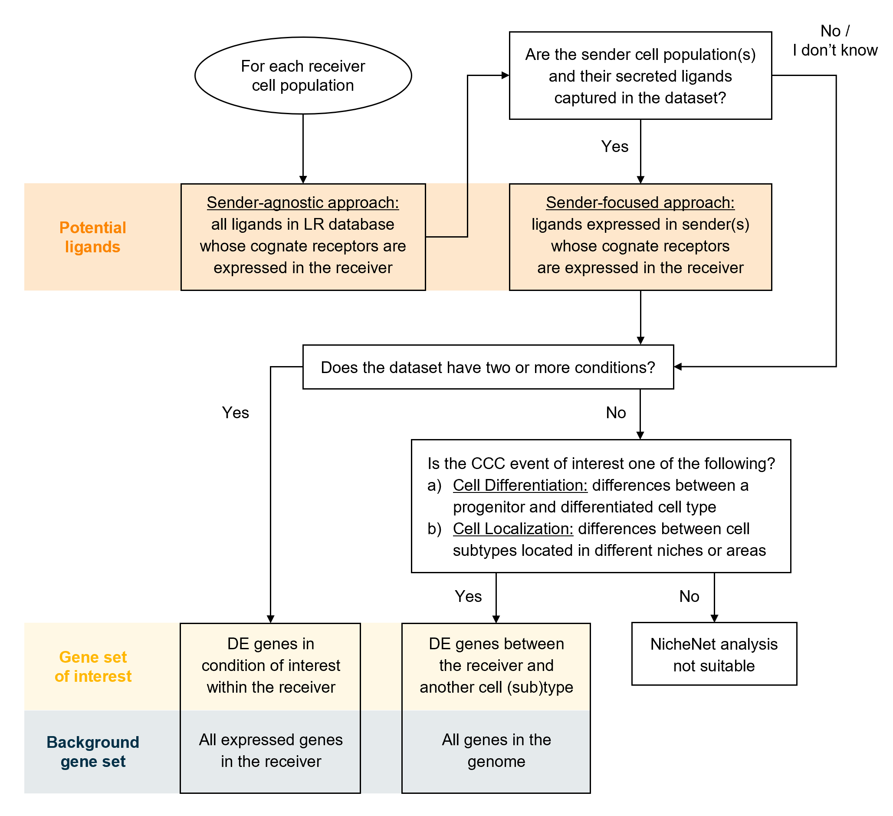

```{r setup, include=FALSE}
knitr::opts_chunk$set(echo = TRUE, fig.width=8)
```

In this tutorial, we will demonstrate the procedure for the scenario where you want to explore cell-cell communication differences between cell types, instead of  between two conditions of the same cell type. This corresponds to the "Cell Localization" scenario in the flowchart below:

{width=75%}

### Load data and networks

We will be using the mouse liver scRNA-seq data generated in the [Guilliams et al (2022) paper](https://www.sciencedirect.com/science/article/pii/S0092867421014811). A subset of this data will be used for this tutorial, available on Zenodo at [https://zenodo.org/records/5840787]. The full dataset can be accessed at the [Liver Cell Atlas](https://livercellatlas.org/).

We will look at cell-cell communication differences between Kupffer cells, the resident liver macrophages, and bile duct and capsule macrophages. This means that we are interested in identifying the Kupffer cell-specific ligands important for its identity. We will be focusing on the niche cells of KCs, which are liver sinusoidal endothelial cells (LSECs), hepatocytes, and stellate cells. Therefore, we will skip the sender-agnostic approach for this analysis.


```{r load data and networks}

seuratObj <- readRDS("data/seurat_obj_subset_integrated_zonation.rds")

ligand_target_matrix <- readRDS("networks/ligand_target_matrix_nsga2r_final_mouse.rds")
lr_network <- readRDS("networks/lr_network_mouse_21122021.rds")
weighted_networks <- readRDS("networks/weighted_networks_nsga2r_final_mouse.rds")

```


# Procedure

The gene set of interest is chosen as the DE genes between Kupffer cells and other macrophages, while the background gene set is the entire genome.

## Feature extraction

1. Load required libraries.

```{r feature extraction - I, warning=FALSE, message=FALSE}

library(nichenetr)
library(Seurat) 
library(tidyverse) 

```

2. *(Optional)* For older Seurat objects, update it to be compatible with the currently installed Seurat version. We will also ensure that the SCT assay is used for differential expression. 

```{r feature extraction - II, message=FALSE, warning=FALSE}
seuratObj <- UpdateSeuratObject(seuratObj)
DefaultAssay(seuratObj) <- "SCT"

seuratObj
```

3. Set the cell type annotation column as the identity of the Seurat object.

```{r feature extraction - III}

Idents(seuratObj) <- seuratObj$celltype 

```

4. Define a "receiver" cell population. The receiver cell population can only consist of one cell type.

```{r feature extraction - IV}

receiver <- "KCs" 

```

5. Determine which genes are expressed in the receiver cell population. The function `get_expressed_genes` considers genes to be expressed if they have non-zero counts in a certain percentage of the cell population (by default set at 10%). Users are also free to define expressed genes differently in a way that fits their data.  

```{r feature extraction - V}

expressed_genes_receiver <- get_expressed_genes(receiver, seuratObj,  pct = 0.1)

# Preview
length(expressed_genes_receiver)
head(expressed_genes_receiver)
```

6. Get a list of all receptors available in the ligand-receptor network, and define expressed receptors as genes that are in the ligand-receptor network and expressed in the receiver.

```{r feature extraction - VI}

all_receptors <- unique(lr_network$to)  
expressed_receptors <- intersect(all_receptors, expressed_genes_receiver) 

# Preview
length(expressed_receptors)
head(expressed_receptors)

```

7. While it is possible to get potential ligands as we did in the previous vignette, we would like to add an additional filter where we only consider ligands that are up-regulated in sender cells from the KC niche compared to other sender cells from the other niche. Thus, we perform a pairwise DE analysis between each sender in the KC niche and each sender in other niches (Cholangiocytes and fibroblast for the bile duct macrophage niche, and capsule fibroblasts and mesothelial cells for the capsule macrophage niche). For each sender in the KC niche, we only retain genes that are significantly upregulated compared to the other four senders. 

```{r feature extraction - VII}

seuratObj <- PrepSCTFindMarkers(seuratObj, assay = "SCT", verbose = TRUE)

# KC niche senders and other niche senders
sender_celltypes <- c("LSECs_portal", "Hepatocytes_portal", "Stellate cells_portal") 
other_niche_celltypes <- c("Cholangiocytes", "Fibroblast 2", "Capsule fibroblasts", "Mesothelial cells")

# Loop over each KC niche sender
list_DE_genes_senders <- lapply(sender_celltypes, function(sender_celltype) {
  # Loop over other niche senders
  DE_genes_list <- lapply(other_niche_celltypes, function(other_niche_celltype) {
    # Perform pairwise DE analysis
    FindMarkers(seuratObj, ident.1 = sender_celltype, ident.2 = other_niche_celltype,
                       min.pct = 0.1, assay="SCT") %>%
      filter(p_val_adj <= 0.05 & avg_log2FC >= 0.25) %>% rownames()
  })
  # Only keep genes that are upregulated compared to ALL other niche senders
  Reduce(intersect, DE_genes_list)
})

# Merge genes from LSECs, Hhpatocytes, and stellate cells
expressed_genes_sender <- unique(unlist(list_DE_genes_senders)) 

# Get potential ligands
potential_ligands <- lr_network[lr_network$from %in% expressed_genes_sender & lr_network$to %in% expressed_receptors, ] 
potential_ligands <- unique(potential_ligands$from) 

# Preview
length(expressed_genes_sender)
head(expressed_genes_sender)
length(potential_ligands)
head(potential_ligands)
```


8. Define the gene set of interest that represents the cell-cell communication event to be studied. Perform DE analysis between the cell type of interest (KCs) and other localizations of the cell type (bile duct and capsule macrophages). Similar to above, we only retain genes that are significantly upregulated in KCs compared to both conditions.


```{r feature extraction - VIII}

DE_MoMac1 <- FindMarkers(seuratObj, ident.1 = receiver, ident.2 = 'MoMac1',
                         min.pct = 0.1, assay="SCT")
DE_MoMac2 <- FindMarkers(seuratObj, ident.1 = receiver, ident.2 = 'MoMac2',
                         min.pct = 0.1, assay="SCT")

geneset_oi <- intersect(DE_MoMac1 %>% filter(p_val_adj <= 0.05 & avg_log2FC >= 0.25) %>% rownames(),
                        DE_MoMac2 %>% filter(p_val_adj <= 0.05 & avg_log2FC >= 0.25) %>% rownames())

# Preview
length(geneset_oi)
head(geneset_oi)
```


9. Determine background genes. Instead of using the entire genome as the background like in the flowchart), we can actually use a more specific background gene set in this case, because we only have around 500 target genes and there are around 5,000 expressed genes in KCs. This means that the size of the background gene set is sufficiently larger than the gene set of interest.

```{r feature extraction - IX}

background_expressed_genes <- expressed_genes_receiver

# Preview
length(background_expressed_genes)
head(background_expressed_genes)
```

## Ligand activity analysis and downstream prediction

10. Perform the ligand activity analysis, then sort the ligands based on the area under the precision-recall curve (AUPR).

```{r ligand activity - I}

ligand_activities <- predict_ligand_activities(
  geneset = geneset_oi,
  background_expressed_genes = background_expressed_genes,
  ligand_target_matrix = ligand_target_matrix,
  potential_ligands = potential_ligands) 

ligand_activities <- ligand_activities[order(ligand_activities$aupr_corrected, 	decreasing = TRUE), ] 

# Preview
dim(ligand_activities)
head(ligand_activities)
```

11. Obtain the names of the top 30 ligands.

```{r ligand activity - II}

best_upstream_ligands <- top_n(ligand_activities, 30, aupr_corrected)$test_ligand 
 
# Preview
length(best_upstream_ligands)
head(best_upstream_ligands)
```

12. Infer which genes in the gene set of interest have the highest regulatory potential for each top-ranked ligand. The function `get_weighted_ligand_target_links` will return genes that are in the gene set of interest and are the top `n` targets of a ligand (default: `n = 200`).

```{r ligand activity - III}

active_ligand_target_links_df <- lapply(best_upstream_ligands,
                                        get_weighted_ligand_target_links, 
                                        geneset = geneset_oi, 
                                        ligand_target_matrix = ligand_target_matrix, 
                                        n = 200) 

active_ligand_target_links_df <- drop_na(bind_rows(active_ligand_target_links_df)) 

# Preview
dim(active_ligand_target_links_df)
head(active_ligand_target_links_df)
```

13. Similarly, identify which receptors have the highest interaction potential with the top-ranked ligands.

```{r ligand activity - IV}

ligand_receptor_links_df <- get_weighted_ligand_receptor_links(
  best_upstream_ligands, expressed_receptors,
  lr_network, weighted_networks$lr_sig) 

# Preview
dim(ligand_receptor_links_df)
head(ligand_receptor_links_df)

```

## Visualizations

Visualizations covered in this section include: heatmaps of ligand-target regulatory potential (Steps 14-15), ligand-receptor interaction potential (Step 16), ligand activity (Step 17); a dot plot of cell type expression and percentage (Step 18); a chord diagram (Steps 19-22).

14. Prepare the weighted ligand-target data frame for visualization by transforming it into matrix. By default, regulatory potentials lower than the 25th percentile are set to zero for visualization clarity. This cutoff parameter can freely be tuned by the user.

```{r visualizations-I}

active_ligand_target_links <- prepare_ligand_target_visualization(
  ligand_target_df = active_ligand_target_links_df,
  ligand_target_matrix = ligand_target_matrix,
  cutoff = 0.5) 

```

15. Order the rows to follow the rankings of the ligands, and the columns alphabetically.

```{r visualizations-II, fig.width = 10}

order_ligands <- rev(intersect(best_upstream_ligands, colnames(active_ligand_target_links))) 
order_targets <- intersect(unique(active_ligand_target_links_df$target), rownames(active_ligand_target_links)) 

vis_ligand_target <- t(active_ligand_target_links[order_targets,order_ligands])

(make_heatmap_ggplot(vis_ligand_target, y_name = "Prioritized ligands", x_name = "Predicted target genes",
                     color = "purple", legend_title = "Regulatory potential") + 
    scale_fill_gradient2(low = "whitesmoke",  high = "purple")) 

```

16. Create a heatmap for ligand-receptor interactions.

```{r visualizations-III}

vis_ligand_receptor_network <- prepare_ligand_receptor_visualization(
  ligand_receptor_links_df, best_upstream_ligands,
  order_hclust = "receptors") 

(make_heatmap_ggplot(t(vis_ligand_receptor_network), 
                     y_name = "Ligands", x_name = "Receptors",  
                     color = "mediumvioletred", legend_title = "Prior interaction potential")) 
 
```

17. Create a heatmap of the ligand activity measure.

```{r visualizations-IV, fig.width=2.5, fig.height = 5}

ligand_aupr_matrix <- column_to_rownames(ligand_activities, "test_ligand") 
ligand_aupr_matrix <- ligand_aupr_matrix[rev(best_upstream_ligands), "aupr_corrected", drop=FALSE] 
vis_ligand_aupr <- as.matrix(ligand_aupr_matrix, ncol = 1) 

(make_heatmap_ggplot(vis_ligand_aupr,
                     "Prioritized ligands", "Ligand activity", 
                     legend_title = "AUPR", color = "darkorange") + 
    theme(axis.text.x.top = element_blank()))  

```

18. Create a dot plot showing the average expression of ligands per cell type, as well as the percentage of cells from the cell type expressing the ligands (Figure 3e).

```{r visualizations-V, fig.height = 7}

DotPlot(subset(seuratObj, celltype %in% sender_celltypes),
        features = rev(best_upstream_ligands), cols = "RdYlBu") + 
  coord_flip() +
  scale_y_discrete(position = "right") 

```

19. To create a ligand-target chord diagram, assign each ligand to a specific cell type. A ligand is only assigned to a cell type if that cell type is the only one to show an average expression of that ligand that is higher than the mean + one standard deviation across all cell types. Otherwise, it is assigned to "General".

```{r visualizations-VI}
ligand_type_indication_df <- assign_ligands_to_celltype(subset(seuratObj, idents = sender_celltypes),
                                                        best_upstream_ligands[1:20], celltype_col = "celltype") 

# Preview
dim(ligand_type_indication_df)
head(ligand_type_indication_df)

```


20. Using the weighted ligand-target data frame from Step 15, group target genes and filter out the lowest 40% of the regulatory potentials. In this case, there is only one grouping of target genes (DE genes after LCMV infection), but users can define multiple target gene groups if applicable. In case the resulting chord diagram is still overcrowded, users may adjust the `cutoff` parameter to filter out even more ligand-target links.

```{r visualizations-VII}

active_ligand_target_links_df$target_type <- "KCs" 
circos_links <- get_ligand_target_links_oi(ligand_type_indication_df,
                                           active_ligand_target_links_df, cutoff = 0.40) 

# Preview
dim(circos_links)
head(circos_links)

```

21. Assign colors to cell types and target gene groups. Then, prepare the data frame for visualization: the function assigns colors to ligands and targets and calculates gaps between sectors of the chord diagram.

```{r visualizations-VIII}

ligand_colors <- c("LSECs_portal" = "#377EB8", "Hepatocytes_portal" = "#4DAF4A", "Stellate cells_portal" = "#984EA3") 
target_colors <- c("KCs" = "#FF7F00")

vis_circos_obj <- prepare_circos_visualization(circos_links,
                                               ligand_colors = ligand_colors,
                                               target_colors = target_colors) 

```

22. Draw the chord diagram.

```{r visualizations-IX, fig.width=10}

make_circos_plot(vis_circos_obj, transparency = FALSE,  args.circos.text = list(cex = 0.5)) 

```


**Session info**

```{r session Info}
sessionInfo()
```
