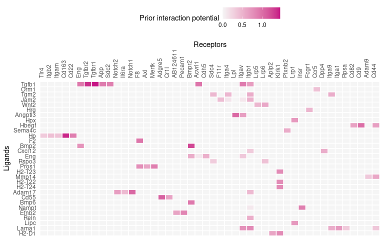

NicheNet training: differentiation study example
================
2024-05-31

In this tutorial, we will demonstrate the procedure for the scenario
where you want to explore cell-cell communication differences between
cell types, instead of between two conditions of the same cell type.
This corresponds to the “Cell Localization” scenario in the flowchart
below:


### Load data and networks

We will be using the mouse liver scRNA-seq data generated in the
[Guilliams et al (2022)
paper](https://www.sciencedirect.com/science/article/pii/S0092867421014811).
A subset of this data will be used for this tutorial, available on
Zenodo at \[<https://zenodo.org/records/5840787>\]. The full dataset can
be accessed at the [Liver Cell Atlas](https://livercellatlas.org/).

We will look at cell-cell communication differences between Kupffer
cells, the resident liver macrophages, and bile duct and capsule
macrophages. This means that we are interested in identifying the
Kupffer cell-specific ligands important for its identity. We will be
focusing on the niche cells of KCs, which are liver sinusoidal
endothelial cells (LSECs), hepatocytes, and stellate cells. Therefore,
we will skip the sender-agnostic approach for this analysis.

``` r
seuratObj <- readRDS("data/seurat_obj_subset_integrated_zonation.rds")

ligand_target_matrix <- readRDS("networks/ligand_target_matrix_nsga2r_final_mouse.rds")
lr_network <- readRDS("networks/lr_network_mouse_21122021.rds")
weighted_networks <- readRDS("networks/weighted_networks_nsga2r_final_mouse.rds")
```

# Procedure

The gene set of interest is chosen as the DE genes between Kupffer cells
and other macrophages, while the background gene set is the entire
genome.

## Feature extraction

1.  Load required libraries.

``` r
library(nichenetr)
library(Seurat) 
library(tidyverse) 
```

2.  *(Optional)* For older Seurat objects, update it to be compatible
    with the currently installed Seurat version. We will also ensure
    that the SCT assay is used for differential expression.

``` r
seuratObj <- UpdateSeuratObject(seuratObj)
DefaultAssay(seuratObj) <- "SCT"

seuratObj
```

    ## An object of class Seurat 
    ## 41774 features across 10670 samples within 3 assays 
    ## Active assay: SCT (18329 features, 0 variable features)
    ##  3 layers present: counts, data, scale.data
    ##  2 other assays present: RNA, integrated
    ##  2 dimensional reductions calculated: pca, umap

3.  Set the cell type annotation column as the identity of the Seurat
    object.

``` r
Idents(seuratObj) <- seuratObj$celltype 
```

4.  Define a “receiver” cell population. The receiver cell population
    can only consist of one cell type.

``` r
receiver <- "KCs" 
```

5.  Determine which genes are expressed in the receiver cell population.
    The function `get_expressed_genes` considers genes to be expressed
    if they have non-zero counts in a certain percentage of the cell
    population (by default set at 10%). Users are also free to define
    expressed genes differently in a way that fits their data.

``` r
expressed_genes_receiver <- get_expressed_genes(receiver, seuratObj,  pct = 0.1)

# Preview
length(expressed_genes_receiver)
```

    ## [1] 5298

``` r
head(expressed_genes_receiver)
```

    ## [1] "Mrpl15"  "Lypla1"  "Tcea1"   "Atp6v1h" "Rb1cc1"  "Pcmtd1"

6.  Get a list of all receptors available in the ligand-receptor
    network, and define expressed receptors as genes that are in the
    ligand-receptor network and expressed in the receiver.

``` r
all_receptors <- unique(lr_network$to)  
expressed_receptors <- intersect(all_receptors, expressed_genes_receiver) 

# Preview
length(expressed_receptors)
```

    ## [1] 207

``` r
head(expressed_receptors)
```

    ## [1] "Itgal"     "F11r"      "Mgrn1"     "Lrp1"      "Tnfrsf11a" "App"

7.  While it is possible to get potential ligands as we did in the
    previous vignette, we would like to add an additional filter where
    we only consider ligands that are up-regulated in sender cells from
    the KC niche compared to other sender cells from the other niche.
    Thus, we perform a pairwise DE analysis between each sender in the
    KC niche and each sender in other niches (Cholangiocytes and
    fibroblast for the bile duct macrophage niche, and capsule
    fibroblasts and mesothelial cells for the capsule macrophage niche).
    For each sender in the KC niche, we only retain genes that are
    significantly upregulated compared to the other four senders.

``` r
seuratObj <- PrepSCTFindMarkers(seuratObj, assay = "SCT", verbose = TRUE)
```

    ## Found 3 SCT models. Recorrecting SCT counts using minimum median counts: 2591.5

``` r
# KC niche senders and other niche senders
sender_celltypes <- c("LSECs_portal", "Hepatocytes_portal", "Stellate cells_portal") 
other_niche_celltypes <- c("Cholangiocytes", "Fibroblast 2", "Capsule fibroblasts", "Mesothelial cells")

# Loop over each KC niche sender
list_DE_genes_senders <- lapply(sender_celltypes, function(sender_celltype) {
  # Loop over other niche senders
  DE_genes_list <- lapply(other_niche_celltypes, function(other_niche_celltype) {
    # Perform pairwise DE analysis
    FindMarkers(seuratObj, ident.1 = sender_celltype, ident.2 = other_niche_celltype,
                       min.pct = 0.1, assay="SCT") %>%
      filter(p_val_adj <= 0.05 & avg_log2FC >= 0.25) %>% rownames()
  })
  # Only keep genes that are upregulated compared to ALL other niche senders
  Reduce(intersect, DE_genes_list)
})

# Merge genes from LSECs, Hhpatocytes, and stellate cells
expressed_genes_sender <- unique(unlist(list_DE_genes_senders)) 

# Get potential ligands
potential_ligands <- lr_network[lr_network$from %in% expressed_genes_sender & lr_network$to %in% expressed_receptors, ] 
potential_ligands <- unique(potential_ligands$from) 

# Preview
length(expressed_genes_sender)
```

    ## [1] 2306

``` r
head(expressed_genes_sender)
```

    ## [1] "Maf"      "Ptprb"    "Eng"      "Kdr"      "Dnase1l3" "Mrc1"

``` r
length(potential_ligands)
```

    ## [1] 122

``` r
head(potential_ligands)
```

    ## [1] "Adam17"  "Adam9"   "Adgre5"  "Ahsg"    "Angptl2" "Angptl3"

8.  Define the gene set of interest that represents the cell-cell
    communication event to be studied. Perform DE analysis between the
    cell type of interest (KCs) and other localizations of the cell type
    (bile duct and capsule macrophages). Similar to above, we only
    retain genes that are significantly upregulated in KCs compared to
    both conditions.

``` r
DE_MoMac1 <- FindMarkers(seuratObj, ident.1 = receiver, ident.2 = 'MoMac1',
                         min.pct = 0.1, assay="SCT")
DE_MoMac2 <- FindMarkers(seuratObj, ident.1 = receiver, ident.2 = 'MoMac2',
                         min.pct = 0.1, assay="SCT")

geneset_oi <- intersect(DE_MoMac1 %>% filter(p_val_adj <= 0.05 & avg_log2FC >= 0.25) %>% rownames(),
                        DE_MoMac2 %>% filter(p_val_adj <= 0.05 & avg_log2FC >= 0.25) %>% rownames())

# Preview
length(geneset_oi)
```

    ## [1] 480

``` r
head(geneset_oi)
```

    ## [1] "Cd5l"    "Slc40a1" "Vsig4"   "Clec4f"  "Sdc3"    "Fcna"

9.  Determine background genes. Instead of using the entire genome as
    the background like in the flowchart), we can actually use a more
    specific background gene set in this case, because we only have
    around 500 target genes and there are around 5,000 expressed genes
    in KCs. This means that the size of the background gene set is
    sufficiently larger than the gene set of interest.

``` r
background_expressed_genes <- expressed_genes_receiver

# Preview
length(background_expressed_genes)
```

    ## [1] 5298

``` r
head(background_expressed_genes)
```

    ## [1] "Mrpl15"  "Lypla1"  "Tcea1"   "Atp6v1h" "Rb1cc1"  "Pcmtd1"

## Ligand activity analysis and downstream prediction

10. Perform the ligand activity analysis, then sort the ligands based on
    the area under the precision-recall curve (AUPR).

``` r
ligand_activities <- predict_ligand_activities(
  geneset = geneset_oi,
  background_expressed_genes = background_expressed_genes,
  ligand_target_matrix = ligand_target_matrix,
  potential_ligands = potential_ligands) 

ligand_activities <- ligand_activities[order(ligand_activities$aupr_corrected,  decreasing = TRUE), ] 

# Preview
dim(ligand_activities)
```

    ## [1] 122   5

``` r
head(ligand_activities)
```

    ## # A tibble: 6 × 5
    ##   test_ligand auroc  aupr aupr_corrected pearson
    ##   <chr>       <dbl> <dbl>          <dbl>   <dbl>
    ## 1 Tgfb1       0.612 0.143         0.0519  0.116 
    ## 2 Orm1        0.591 0.131         0.0400  0.0911
    ## 3 Tgm2        0.568 0.128         0.0372  0.0562
    ## 4 Jam2        0.578 0.127         0.0360  0.0793
    ## 5 Wnt2        0.552 0.126         0.0347  0.0779
    ## 6 Hrg         0.569 0.124         0.0335  0.0599

11. Obtain the names of the top 30 ligands.

``` r
best_upstream_ligands <- top_n(ligand_activities, 30, aupr_corrected)$test_ligand 
 
# Preview
length(best_upstream_ligands)
```

    ## [1] 30

``` r
head(best_upstream_ligands)
```

    ## [1] "Tgfb1" "Orm1"  "Tgm2"  "Jam2"  "Wnt2"  "Hrg"

12. Infer which genes in the gene set of interest have the highest
    regulatory potential for each top-ranked ligand. The function
    `get_weighted_ligand_target_links` will return genes that are in the
    gene set of interest and are the top `n` targets of a ligand
    (default: `n = 200`).

``` r
active_ligand_target_links_df <- lapply(best_upstream_ligands,
                                        get_weighted_ligand_target_links, 
                                        geneset = geneset_oi, 
                                        ligand_target_matrix = ligand_target_matrix, 
                                        n = 200) 

active_ligand_target_links_df <- drop_na(bind_rows(active_ligand_target_links_df)) 

# Preview
dim(active_ligand_target_links_df)
```

    ## [1] 271   3

``` r
head(active_ligand_target_links_df)
```

    ## # A tibble: 6 × 3
    ##   ligand target weight
    ##   <chr>  <chr>   <dbl>
    ## 1 Tgfb1  Csf1r   0.175
    ## 2 Tgfb1  Dapk1   0.164
    ## 3 Tgfb1  Hbegf   0.181
    ## 4 Tgfb1  Hmox1   0.273
    ## 5 Tgfb1  Igfbp7  0.172
    ## 6 Tgfb1  Klf7    0.236

13. Similarly, identify which receptors have the highest interaction
    potential with the top-ranked ligands.

``` r
ligand_receptor_links_df <- get_weighted_ligand_receptor_links(
  best_upstream_ligands, expressed_receptors,
  lr_network, weighted_networks$lr_sig) 

# Preview
dim(ligand_receptor_links_df)
```

    ## [1] 72  3

``` r
head(ligand_receptor_links_df)
```

    ## # A tibble: 6 × 3
    ##   from    to     weight
    ##   <chr>   <chr>   <dbl>
    ## 1 Adam17  Il6ra   0.447
    ## 2 Adam17  Itgb1   0.454
    ## 3 Adam17  Notch1  1.05 
    ## 4 Adam17  Notch2  0.655
    ## 5 Angptl3 Itgav   0.657
    ## 6 Angptl3 Lpl     1.04

## Visualizations

Visualizations covered in this section include: heatmaps of
ligand-target regulatory potential (Steps 14-15), ligand-receptor
interaction potential (Step 16), ligand activity (Step 17); a dot plot
of cell type expression and percentage (Step 18); a chord diagram (Steps
19-22).

14. Prepare the weighted ligand-target data frame for visualization by
    transforming it into matrix. By default, regulatory potentials lower
    than the 25th percentile are set to zero for visualization clarity.
    This cutoff parameter can freely be tuned by the user.

``` r
active_ligand_target_links <- prepare_ligand_target_visualization(
  ligand_target_df = active_ligand_target_links_df,
  ligand_target_matrix = ligand_target_matrix,
  cutoff = 0.5) 
```

15. Order the rows to follow the rankings of the ligands, and the
    columns alphabetically.

``` r
order_ligands <- rev(intersect(best_upstream_ligands, colnames(active_ligand_target_links))) 
order_targets <- intersect(unique(active_ligand_target_links_df$target), rownames(active_ligand_target_links)) 

vis_ligand_target <- t(active_ligand_target_links[order_targets,order_ligands])

(make_heatmap_ggplot(vis_ligand_target, y_name = "Prioritized ligands", x_name = "Predicted target genes",
                     color = "purple", legend_title = "Regulatory potential") + 
    scale_fill_gradient2(low = "whitesmoke",  high = "purple")) 
```

    ## Scale for fill is already present.
    ## Adding another scale for fill, which will replace the existing scale.

<!-- -->

16. Create a heatmap for ligand-receptor interactions.

``` r
vis_ligand_receptor_network <- prepare_ligand_receptor_visualization(
  ligand_receptor_links_df, best_upstream_ligands,
  order_hclust = "receptors") 

(make_heatmap_ggplot(t(vis_ligand_receptor_network), 
                     y_name = "Ligands", x_name = "Receptors",  
                     color = "mediumvioletred", legend_title = "Prior interaction potential")) 
```

<!-- -->

17. Create a heatmap of the ligand activity measure.

``` r
ligand_aupr_matrix <- column_to_rownames(ligand_activities, "test_ligand") 
ligand_aupr_matrix <- ligand_aupr_matrix[rev(best_upstream_ligands), "aupr_corrected", drop=FALSE] 
vis_ligand_aupr <- as.matrix(ligand_aupr_matrix, ncol = 1) 

(make_heatmap_ggplot(vis_ligand_aupr,
                     "Prioritized ligands", "Ligand activity", 
                     legend_title = "AUPR", color = "darkorange") + 
    theme(axis.text.x.top = element_blank()))  
```

<!-- -->

18. Create a dot plot showing the average expression of ligands per cell
    type, as well as the percentage of cells from the cell type
    expressing the ligands (Figure 3e).

``` r
DotPlot(subset(seuratObj, celltype %in% sender_celltypes),
        features = rev(best_upstream_ligands), cols = "RdYlBu") + 
  coord_flip() +
  scale_y_discrete(position = "right") 
```

    ## Warning: Scaling data with a low number of groups may produce misleading
    ## results

<!-- -->

19. To create a ligand-target chord diagram, assign each ligand to a
    specific cell type. A ligand is only assigned to a cell type if that
    cell type is the only one to show an average expression of that
    ligand that is higher than the mean + one standard deviation across
    all cell types. Otherwise, it is assigned to “General”.

``` r
ligand_type_indication_df <- assign_ligands_to_celltype(subset(seuratObj, idents = sender_celltypes),
                                                        best_upstream_ligands[1:20], celltype_col = "celltype") 
```

    ## Warning: Layer counts isn't present in the assay object; returning NULL

``` r
# Preview
dim(ligand_type_indication_df)
```

    ## [1] 20  2

``` r
head(ligand_type_indication_df)
```

    ##          ligand_type  ligand
    ## 1 Hepatocytes_portal    Orm1
    ## 2 Hepatocytes_portal     Hrg
    ## 3 Hepatocytes_portal Angptl3
    ## 4 Hepatocytes_portal     Hpx
    ## 5 Hepatocytes_portal      Hp
    ## 6 Hepatocytes_portal      F2

20. Using the weighted ligand-target data frame from Step 15, group
    target genes and filter out the lowest 40% of the regulatory
    potentials. In this case, there is only one grouping of target genes
    (DE genes after LCMV infection), but users can define multiple
    target gene groups if applicable. In case the resulting chord
    diagram is still overcrowded, users may adjust the `cutoff`
    parameter to filter out even more ligand-target links.

``` r
active_ligand_target_links_df$target_type <- "KCs" 
circos_links <- get_ligand_target_links_oi(ligand_type_indication_df,
                                           active_ligand_target_links_df, cutoff = 0.40) 
```

    ## Joining with `by = join_by(ligand)`

``` r
# Preview
dim(circos_links)
```

    ## [1] 147   5

``` r
head(circos_links)
```

    ## # A tibble: 6 × 5
    ##   ligand target weight target_type ligand_type 
    ##   <chr>  <chr>   <dbl> <chr>       <chr>       
    ## 1 Tgfb1  Csf1r   0.175 KCs         LSECs_portal
    ## 2 Tgfb1  Dapk1   0.164 KCs         LSECs_portal
    ## 3 Tgfb1  Hbegf   0.181 KCs         LSECs_portal
    ## 4 Tgfb1  Hmox1   0.273 KCs         LSECs_portal
    ## 5 Tgfb1  Igfbp7  0.172 KCs         LSECs_portal
    ## 6 Tgfb1  Klf7    0.236 KCs         LSECs_portal

21. Assign colors to cell types and target gene groups. Then, prepare
    the data frame for visualization: the function assigns colors to
    ligands and targets and calculates gaps between sectors of the chord
    diagram.

``` r
ligand_colors <- c("LSECs_portal" = "#377EB8", "Hepatocytes_portal" = "#4DAF4A", "Stellate cells_portal" = "#984EA3") 
target_colors <- c("KCs" = "#FF7F00")

vis_circos_obj <- prepare_circos_visualization(circos_links,
                                               ligand_colors = ligand_colors,
                                               target_colors = target_colors) 
```

    ## Joining with `by = join_by(ligand_type)`
    ## Joining with `by = join_by(target_type)`

22. Draw the chord diagram.

``` r
make_circos_plot(vis_circos_obj, transparency = FALSE,  args.circos.text = list(cex = 0.5)) 
```

<!-- -->

**Session info**

``` r
sessionInfo()
```

    ## R version 4.3.3 (2024-02-29)
    ## Platform: x86_64-pc-linux-gnu (64-bit)
    ## Running under: CentOS Stream 8
    ## 
    ## Matrix products: default
    ## BLAS/LAPACK: /usr/lib64/libopenblasp-r0.3.15.so;  LAPACK version 3.9.0
    ## 
    ## locale:
    ##  [1] LC_CTYPE=en_US.UTF-8       LC_NUMERIC=C              
    ##  [3] LC_TIME=en_US.UTF-8        LC_COLLATE=en_US.UTF-8    
    ##  [5] LC_MONETARY=en_US.UTF-8    LC_MESSAGES=en_US.UTF-8   
    ##  [7] LC_PAPER=en_US.UTF-8       LC_NAME=C                 
    ##  [9] LC_ADDRESS=C               LC_TELEPHONE=C            
    ## [11] LC_MEASUREMENT=en_US.UTF-8 LC_IDENTIFICATION=C       
    ## 
    ## time zone: Europe/Brussels
    ## tzcode source: system (glibc)
    ## 
    ## attached base packages:
    ## [1] stats     graphics  grDevices utils     datasets  methods   base     
    ## 
    ## other attached packages:
    ##  [1] lubridate_1.9.3    forcats_1.0.0      stringr_1.5.1      dplyr_1.1.4       
    ##  [5] purrr_1.0.2        readr_2.1.5        tidyr_1.3.1        tibble_3.2.1      
    ##  [9] ggplot2_3.5.1      tidyverse_2.0.0    Seurat_5.1.0       SeuratObject_5.0.2
    ## [13] sp_2.1-4           nichenetr_2.2.0   
    ## 
    ## loaded via a namespace (and not attached):
    ##   [1] RcppAnnoy_0.0.22       splines_4.3.3          later_1.3.2           
    ##   [4] bitops_1.0-7           polyclip_1.10-6        hardhat_1.3.1         
    ##   [7] pROC_1.18.5            rpart_4.1.23           fastDummies_1.7.3     
    ##  [10] lifecycle_1.0.4        doParallel_1.0.17      globals_0.16.3        
    ##  [13] lattice_0.22-5         MASS_7.3-60.0.1        backports_1.4.1       
    ##  [16] magrittr_2.0.3         limma_3.58.1           Hmisc_5.1-2           
    ##  [19] plotly_4.10.4          rmarkdown_2.27         yaml_2.3.8            
    ##  [22] httpuv_1.6.15          sctransform_0.4.1      spam_2.10-0           
    ##  [25] spatstat.sparse_3.0-3  reticulate_1.37.0      cowplot_1.1.3         
    ##  [28] pbapply_1.7-2          RColorBrewer_1.1-3     abind_1.4-5           
    ##  [31] Rtsne_0.17             presto_1.0.0           BiocGenerics_0.48.1   
    ##  [34] nnet_7.3-19            tweenr_2.0.3           ipred_0.9-14          
    ##  [37] circlize_0.4.16        lava_1.8.0             IRanges_2.36.0        
    ##  [40] S4Vectors_0.40.2       ggrepel_0.9.5          irlba_2.3.5.1         
    ##  [43] listenv_0.9.1          spatstat.utils_3.1-0   goftest_1.2-3         
    ##  [46] RSpectra_0.16-1        spatstat.random_3.2-3  fitdistrplus_1.1-11   
    ##  [49] parallelly_1.37.1      leiden_0.4.3.1         codetools_0.2-19      
    ##  [52] ggforce_0.4.2          tidyselect_1.2.1       shape_1.4.6.1         
    ##  [55] farver_2.1.2           base64enc_0.1-3        matrixStats_1.3.0     
    ##  [58] stats4_4.3.3           spatstat.explore_3.2-7 jsonlite_1.8.8        
    ##  [61] caret_6.0-94           GetoptLong_1.0.5       e1071_1.7-14          
    ##  [64] Formula_1.2-5          progressr_0.14.0       ggridges_0.5.6        
    ##  [67] survival_3.5-8         iterators_1.0.14       foreach_1.5.2         
    ##  [70] tools_4.3.3            ggnewscale_0.4.10      ica_1.0-3             
    ##  [73] Rcpp_1.0.12            glue_1.7.0             prodlim_2023.08.28    
    ##  [76] gridExtra_2.3          xfun_0.44              withr_3.0.0           
    ##  [79] fastmap_1.2.0          fansi_1.0.6            caTools_1.18.2        
    ##  [82] digest_0.6.35          timechange_0.3.0       R6_2.5.1              
    ##  [85] mime_0.12              colorspace_2.1-0       scattermore_1.2       
    ##  [88] tensor_1.5             spatstat.data_3.0-4    DiagrammeR_1.0.11     
    ##  [91] utf8_1.2.4             generics_0.1.3         data.table_1.15.4     
    ##  [94] recipes_1.0.10         class_7.3-22           httr_1.4.7            
    ##  [97] htmlwidgets_1.6.4      uwot_0.2.2             ModelMetrics_1.2.2.2  
    ## [100] pkgconfig_2.0.3        gtable_0.3.5           timeDate_4032.109     
    ## [103] ComplexHeatmap_2.18.0  lmtest_0.9-40          shadowtext_0.1.3      
    ## [106] htmltools_0.5.8.1      dotCall64_1.1-1        clue_0.3-65           
    ## [109] scales_1.3.0           png_0.1-8              gower_1.0.1           
    ## [112] knitr_1.46             rstudioapi_0.16.0      tzdb_0.4.0            
    ## [115] reshape2_1.4.4         rjson_0.2.21           checkmate_2.3.1       
    ## [118] visNetwork_2.1.2       nlme_3.1-164           proxy_0.4-27          
    ## [121] zoo_1.8-12             GlobalOptions_0.1.2    KernSmooth_2.23-22    
    ## [124] parallel_4.3.3         miniUI_0.1.1.1         foreign_0.8-86        
    ## [127] pillar_1.9.0           grid_4.3.3             vctrs_0.6.5           
    ## [130] RANN_2.6.1             randomForest_4.7-1.1   promises_1.3.0        
    ## [133] xtable_1.8-4           cluster_2.1.6          htmlTable_2.4.2       
    ## [136] evaluate_0.23          cli_3.6.2              compiler_4.3.3        
    ## [139] rlang_1.1.3            crayon_1.5.2           future.apply_1.11.2   
    ## [142] labeling_0.4.3         fdrtool_1.2.17         plyr_1.8.9            
    ## [145] stringi_1.8.4          viridisLite_0.4.2      deldir_2.0-4          
    ## [148] munsell_0.5.1          lazyeval_0.2.2         spatstat.geom_3.2-9   
    ## [151] Matrix_1.6-5           RcppHNSW_0.6.0         hms_1.1.3             
    ## [154] patchwork_1.2.0        future_1.33.2          statmod_1.5.0         
    ## [157] shiny_1.8.1.1          highr_0.10             ROCR_1.0-11           
    ## [160] igraph_2.0.3
